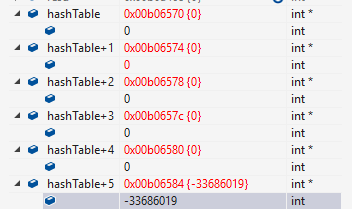
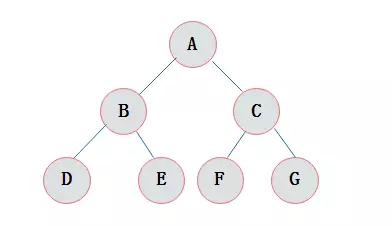
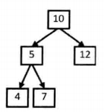
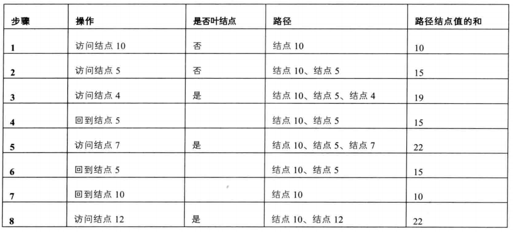
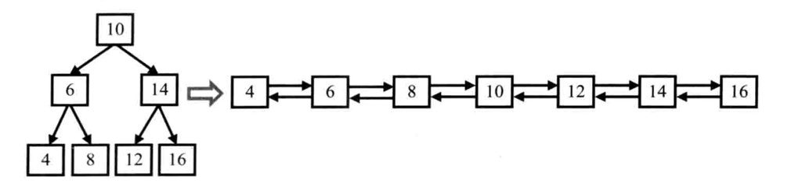
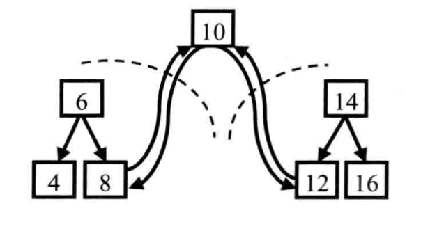
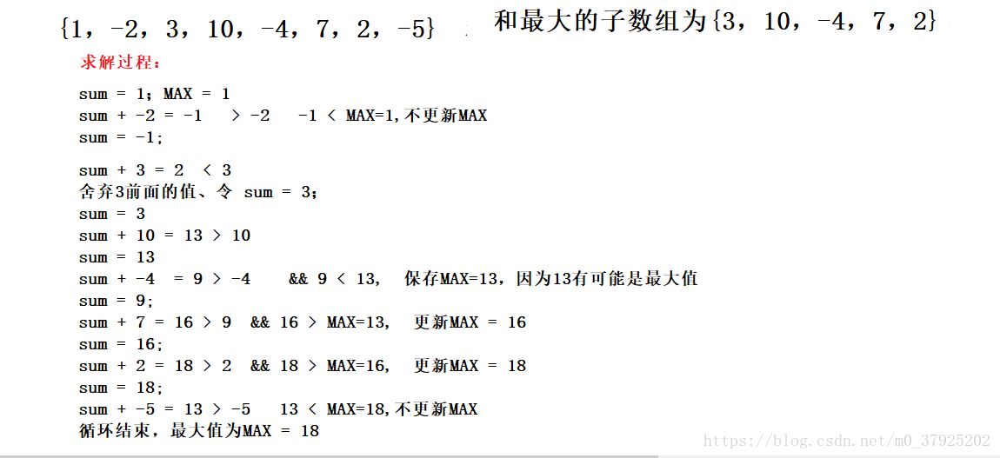

笔试题目汇总

* [Introduction](README.md)
* [拓扑排序](43 拓扑排序.md)
* [最短路径](44 最短路径.md)
* [位图](45 位图.md)

[【剑指offer-第二版】部分题目与解答—C++](https://blog.csdn.net/m0_37950361/article/details/80668712)

# 《剑指offer》

## 3. 数组中的重复数字

### 题目1：

> 参考《剑指offer》P<sub> 39</sub>

```
题目1：找出数组中重复的数字

在一个长度为n的数组里的所有数字都在0~n-1范围内。数组中某些数字是重复的，但不知道有几个数字重复了，也不知道每个数字重复了几次。请找出数组中任意一个重复的数字。例如，如果输入长度为7的数组{2，3，1，0，2，5，3}，那么对应的输出是重复的数字2或者3。
```

- 方法1：先排序

    时间复杂度：O(nlogn)

- 方法2：哈希表

    手动实现一个简易的哈希表

    ```cpp
    class Solution {
    public:
        bool duplicate(int numbers[], int length, int* duplication) {
            if(numbers == nullptr || length <= 1)
                return false;
            
            int* hashtable = new int[length]();
            for(int i=0; i != length; i++){
                if(hashtable[numbers[i]]){
                    *duplication = numbers[i];
                    return true;
                }
                else
                    hashtable[numbers[i]] = 1;
            }
            
            return false;
        }
    };
    ```

    

    使用new初始化的hashtable为0

- 方法3：按序号“重排”

    把每个数字放回对应位置的方法。如果出现一个数字无法放回（所在位置已经是对应数字了），那么说明该数字重复

    ```cpp
    //时间复杂度：O（n）
    class Solution {
    public:
        bool duplicate(int numbers[], int length, int* duplication) {
            if (numbers == nullptr || length <= 1)
                return false;
             
            for(int i=0; i<length; i++)//判断是否有不在区间范围内的值
                if(numbers[i] < 0 || numbers[i] > length-1)
                    return false;
    
            for (int i = 0; i != length; i++) {
                while(numbers[i] != i){
                    if (numbers[numbers[i]] != numbers[i]) {
                        swap(&numbers[numbers[i]], &numbers[i]);
                    }
                    else {
                        *duplication = numbers[i];
                        return true;
                    }
                }
            }
    
            return false;
        }
    
        void swap(int *item1, int *item2) {
            int tmp = *item1;
            *item1 = *item2;
            *item2 = tmp;
        }
    };
    ```

    


### 题目2：

1. 方法1：遍历

    时间复杂度：O(n<sup>2</sup>)

2. 方法2：倒序遍历

    由于是数组的排列有序的，因此从右上角开始判断：

    - 如果该数字大于target，剔除这个数字所在行；

    - 如果该数字小于target，剔除这个数字所在列


## 4. 二维数组查找

### 题目描述：

> 参考《剑指offer》P<sub> 44</sub>

```
在一个二维数组中（每个一维数组的长度相同），每一行都按照从左到右递增的顺序排序，每一列都按照从上到下递增的顺序排序。请完成一个函数，输入这样的一个二维数组和一个整数，判断数组中是否含有该整数。
```

### 思路：

1. 方法1：遍历

    时间复杂度：O(n<sup>2</sup>)

2. 方法2：倒序遍历

    由于是数组的排列有序的，因此从右上角开始判断：

    - 如果该数字大于target，剔除这个数字所在行；

    - 如果该数字小于target，剔除这个数字所在列；

```cpp
class Solution {
public:
    bool Find(int target, vector<vector<int> > array) {
        int rows =  array.size();
        if(rows == 0)
            return false;
        
        int cols = array[0].size();
        if(cols==0)
            return false;
        
        int i=0;
        int j=cols-1;
        while(i!=rows && j>=0)
        {
            if(array[i][j] == target)
                return true;
            else if(array[i][j] > target)
                j--;
            else
                i++;
        }
        
        return false;
    }
};
```

## 5. 替换空格

### 题目描述：

> 参考《剑指offer》P <sub> 51</sub>

```
请实现一个函数，将一个字符串中的每个空格替换成“%20”。例如，当字符串为We Are Happy.则经过替换之后的字符串为We%20Are%20Happy。
```

### 思路：

1. 方法1：遍历字符串，遇到空格就替换

    时间复杂度：O(n<sup>2</sup>)

2. 方法2：从后往前的替换

    先遍历一遍，统计出空格的数量，并计算出替换后的长度。然后从后往前逐个替换。这样做的复杂度为O(n)。


```cpp
class Solution {
public:
	void replaceSpace(char *str,int length) {
        if(str==nullptr || length <=0)
            return;
        
        int spaceNum=0;
        int originalLength=0;
        int i=0;
        //遍历一遍计算空格数量、字符串长度
        while(str[i] != '\0'){
            if(str[i] == ' ')
                spaceNum++;
            originalLength++;
            i++;
        }
        
        int replaceLength = originalLength + spaceNum*2;//计算替换后的长度
        
        if(replaceLength + 1 > length)
            return ;
        
        str[replaceLength] = '\0';
        for(int i=originalLength-1; i>=0; i--){
            if(str[i] != ' ')
                str[--replaceLength] = str[i];
            else{
                str[--replaceLength] = '0';
                str[--replaceLength] = '2';
                str[--replaceLength] = '%';
            }
        }
	}
};
```

==补充：string size()/length()/sizeof()的区别==

### 总结

在合并两个数组或者字符串时，如果从前往后复制每个数字或字符族需要重复移动数字或者字符多次，那么可以考虑从后往前复制，以减少移动次数，从而提高效率。


## 6. 从尾到头打印链表

### 题目描述：

> 参考《剑指offer》P <sub> 58</sub>

```
输入一个链表，按链表值从尾到头的顺序返回一个ArrayList。
```

### 思路：

1. 方法1：反转链表，再打印输出（询问面试官是否允许修改输入）

    时间复杂度：O(n)，参考面试题24

2. 方法2：利用栈结构来实现打印

    遍历是从前往后，输出是从后往前，符合栈的“后进先出”的特点。

    ```
    //方法2：栈结构
    /**
    *  struct ListNode {
    *        int val;
    *        struct ListNode *next;
    *        ListNode(int x) :
    *              val(x), next(NULL) {
    *        }
    *  };
    */
    class Solution {
    public:
        vector<int> printListFromTailToHead(ListNode* head) {
            vector<int> outputVal;
            if(head==nullptr)
                return outputVal;
            
            ListNode *pNode=head;
            //这里只保存链表的值，也可保存链表节点，stack<listNode*>nodes,后续的代码做相应修改
            stack<int> listStack; 
            while(pNode != nullptr)
            {
                listStack.push(pNode->val);
                pNode = pNode->next;
            }
            
            while(!listStack.empty())
            {
                int temp = listStack.top();
                listStack.pop();
                
                outputVal.push_back(temp);
            }
            
            return outputVal;
        }
    };
    ```

3. 方法3：递归实现

    递归在本质上就是一个栈结构：每次访问到一个节点的时候，先递归输出其后面的节点，再输出节点本身，这样链表就能反过来输出了。
    
    ```
    //方法3：递归实现
    /**
    *  struct ListNode {
    *        int val;
    *        struct ListNode *next;
    *        ListNode(int x) :
    *              val(x), next(NULL) {
    *        }
    *  };
    */
    class Solution {
    public:
        vector<int> printListFromTailToHead(ListNode* head) {
            vector<int> outputVal;
            if(head==nullptr)
                return outputVal;
            
            //每次调用将值返回到outputVal中保存
            outputVal = printListFromTailToHead(head->next); 
            outputVal.push_back(head->val);
            
            return outputVal;
        }
    }
    ```

### 总结

基于递归的代码很简洁，但是有一个问题：当链表很长时，函数调用的层级很深，可能导致函数调用栈溢出。因此用栈基于循环的实现更具有鲁棒性。


## 7.重建二叉树

### 题目描述：

> 参考《剑指offer》P<sub> 62</sub>

```
输入某二叉树的前序遍历和中序遍历的结果，请重建出该二叉树。假设输入的前序遍历和中序遍历的结果中都不含重复的数字。例如输入前序遍历序列{1,2,4,7,3,5,6,8}和中序遍历序列{4,7,2,1,5,3,8,6}，则重建二叉树并返回。
```

### 思路：

方法：递归

先根据前序遍历序列的第一个数字创建根节点，接下来在中序遍历中找到根节点的位置，这样就能确定左、右子树节点的数量。在前序遍历和中序中划分了左、右子树节点值之后，就可以递归第调用函数分别构建它的左右子树。

```cpp
/**
 * Definition for binary tree
 * struct TreeNode {
 *     int val;
 *     TreeNode *left;
 *     TreeNode *right;
 *     TreeNode(int x) : val(x), left(NULL), right(NULL) {}
 * };
 */
class Solution {
public:
    TreeNode* reConstructBinaryTree(vector<int> pre,vector<int> vin) {
        if(pre.size()==0 || pre.size() != vin.size())
            return nullptr;
        
        //找根节点
        int root = pre[0];
        TreeNode *newNode = new TreeNode(root);
        if(pre.size()==1)//递归调用到此时，如果只剩一个节点了就直接返回
            return newNode;
        
        //找到root节点在中序遍历中的位置
        auto rootPosition = find(vin.begin(), vin.end(), root);
        if(rootPosition == vin.end())
            return nullptr;
        
        int leftSize=rootPosition - vin.begin();//左子树大小
        int rightSize=vin.end() - rootPosition - 1;//右子树大小
        
        newNode->left = reConstructBinaryTree(vector<int> (pre.begin()+1, pre.begin()+1+leftSize), vector<int>(vin.begin(), vin.begin()+leftSize));
        newNode->right = reConstructBinaryTree(vector<int> (pre.begin()+1+leftSize, pre.end()), vector<int>(vin.begin()+leftSize+1, vin.end()));
                                               
        return newNode;
    }
};
```

```cpp
//测试程序：

#include <vector>
#include <iostream>
#include <string>
#include <stdlib.h>
#include <algorithm>

using namespace std;

struct TreeNode {
    int val;
    TreeNode *left;
    TreeNode *right;
    TreeNode(int x) :val(x), left(nullptr), right(nullptr) {}
};

TreeNode* reConstructBinaryTree(vector<int> pre, vector<int> vin);

int main()
{
    vector<int> pre{1,2,4,5,3,6,7};
    vector<int> vin{4,2,5,1,6,3,7};

    TreeNode *newRoot = reConstructBinaryTree(pre, vin);
    
    return 0;
}
```

### 注意事项

如何使用vector中的部分元素：vector <int>  (pre.begin()+1,  pre.end() - 1)

```
#include <vector>
#include <iostream>
#include <string>
#include <stdlib.h>
#include <algorithm>

using namespace std;

void test(vector<int> pre, vector<char> vin){
    for(auto iter1 : pre)
        cout << iter1 << " ";
    cout << endl;

    for(auto iter2 : vin)
        cout << iter2 << " ";
    cout << endl;
}

int main()
{
    vector<int> pre{1,2,3,4,5};
    vector<char> vin{'a','b','c','d','e'};

    //通常调用
    //test(pre, vin);
    
    //这样的写法会报错
    //test((pre.begin()+1, pre.end() - 1), vin);
    
    //测试1
    //test(vector<int>(pre.begin()+1, pre.end() - 1), vin);
    
    //测试2
    test(vector<int>(pre.begin()+1, pre.end() - 1), vector<char>(vin.end()-2, vin.end()));
    

    return 0;
}
```

```
//测试1：test(vector<int>(pre.begin()+1, pre.end() - 1), vin);
2 3 4
a b c d e

//测试2：test(vector<int>(pre.begin()+1, pre.end()-1), vector<char>(vin.end()-2, vin.end()));
2 3 4
d e
```

### ==总结==

- 如何构建一个二叉树的新节点（new）；

    ```
    int root = pre[0];
    TreeNode *newNode = new TreeNode(root);
    ```

- 如何寻找数组中指定的元素位置（find()）；

    ```
    auto rootPosition = find(vin.begin(), vin.end(), root);
    if(rootPosition == vin.end())
    	return nullptr;
    ```

- 如何只取数组中的一部分元素

    ```
    vector <int>  (pre.begin()+1,  pre.end() - 1)
    ```

## ==8. 二叉树的下一个节点==

**题目描述：**

> 参考《剑指offer》P<sub> 65</sub>

```
给定一个二叉树和其中的一个结点，请找出中序遍历顺序的下一个结点并且返回。注意，树中的结点不仅包含左右子结点，同时包含指向父结点的指针。
```

**思路：**

方法：分情况讨论

<center><p></p></center>
  

1. 如果该节点有右子树，则它的下一个节点就是其右子树的最左子节点；

2. ==如果该节点没有右子树，但是它本身是其父节点的左子节点，那么它的下一个节点就是其父节点；==

3. ==如果该节点没有右子树，并且是其父节点的右子节点，那么它的下一个节点就需要向上不断找父节点，直到找到一个节点是其父节点的左子节点，那么该节点的父节点就要我们要找的下一个节点；==

4. 如果上面的方法都没有找到下一个节点，说明该节点不存在下一个节点，返回nullptr；

    

```cpp
/**
 * Definition for binary tree
struct TreeLinkNode {
    int val;
    struct TreeLinkNode *left;
    struct TreeLinkNode *right;
    struct TreeLinkNode *next;
    TreeLinkNode(int x) :val(x), left(NULL), right(NULL), next(NULL) {
        
    }
};
 */
class Solution {
public:
    TreeLinkNode* GetNext(TreeLinkNode* pNode)
    {
        if(pNode == nullptr)
            return nullptr;
        
        TreeLinkNode* ret = nullptr;
        if(pNode->right != nullptr){ //所给的节点存在右子树的情况
            TreeLinkNode* tmpNode = pNode->right;
            while(tmpNode->left != nullptr){
                tmpNode = tmpNode->left;
            }
            ret = tmpNode;
        }
        else{//不存在右子树的情况
            TreeLinkNode* tmpNode = pNode;
            while(tmpNode->next != nullptr){
                if(tmpNode->next->left == tmpNode){
                    ret = tmpNode->next;
                    break;
                }
                tmpNode = tmpNode->next;
            }
        }
        
        return ret;
    }
};
```

**总结**

- 如何构建一个二叉树的新节点（new）；

    ```
    int root = pre[0];
    TreeNode *newNode = new TreeNode(root);
    ```

- 如何寻找数组中指定的元素位置（find()）；

    ```
    auto rootPosition = find(vin.begin(), vin.end(), root);
    if(rootPosition == vin.end())
    	return nullptr;
    ```

- 如何只取数组中的一部分元素

    ```
    vector <int>  (pre.begin()+1,  pre.end() - 1)
    ```


## 9. 用两个栈来实现队列

### 题目描述：

> 参考《剑指offer》P<sub> 68</sub>

```
用两个栈来实现一个队列，完成队列的Push和Pop操作。 队列中的元素为int类型。
```

### 思路：

固定一个栈用于入队操作，另一个栈用于出队操作： 

- 入队列操作，不管stack1和stack2是什么状态，直接向stack1入栈即可；

- 出队列操作

    如果stack2为空，那么把stack1的元素一个一个弹出并压入到stack2中，完成之后，对stack2进行出栈操作，此元素就是最先入队的元素； 

    如果stack2不为空，那么直接从stack2出栈，此元素是当前所有元素中最先入队的那个；

```cpp
class Solution
{
public:
    void push(int node) {
        stack1.push(node);//栈是单端操作的，因此只有push操作，而不是push_back操作
    }

    int pop() {
        if(!stack2.empty())
        {
            int temp = stack2.top();
            stack2.pop();
            return temp;
        }
        else{
            while(!stack1.empty()){
                int temp =stack1.top();
                stack2.push(temp);
                stack1.pop();
            }
            
            int temp = stack2.top();
            stack2.pop();
            return temp;
        }
    }

private:
    stack<int> stack1;
    stack<int> stack2;
};
```

### 相关题目

两个队列实现一个栈

注意两道题目的异同： 

两个栈实现一个队列：使用栈1来入队，栈2来出队，角色是固定的 ；

两个队列实现一个栈：使用非空队列来入栈，使用空队列来出栈，角色会转换； 

1.入栈操作：哪个队列非空，就把元素插入哪个队列的队尾，如果两个队列都为空，那么就随便使用一个队列。 

2.出栈操作：把非空队列的元素出队并且按顺序一个一个压入另一个队列，直到剩下一个元素，这个元素就是要出栈的元素。输出该元素即可

> 参考《剑指offer》P<sub>72</sub>

### 总结

## 10. 斐波那契数列

### 题目描述：

> 参考《剑指offer》P<sub>74/sub>

```
大家都知道斐波那契数列，现在要求输入一个整数n，请你输出斐波那契数列的第n项（从0开始，第0项为0）。
n<=39
```

### 思路：

- 递归法

    递归的优点是代码简洁，但也存在问题：

    - 大量重复计算问题；

    - 递归调用过深，导致栈溢出；
    - 复杂度：函数调用在时间和空间上都有很大的隐形成本；

- 备忘录法

    将每次计算的结果记录下来，用于下次计算。

- 动态规划法

```cpp
class Solution {
public:
    int Fibonacci(int n) {
        if(n==0)
            return 0;
        if(n==1)
            return 1;
        
        int result;
        int save1=0;
        int save2=1;
        for(int i=2; i<=n; i++){
            result = save1 + save2;
            save1 = save2;
            save2 = result;
        }
        return result;
    }
};
```

### 相关题目

==青蛙条台阶问题==

需要注意的是，如果青蛙可以跳1~级台阶中的任何一个，那么根据规律：

|  n   | 0    | 1    | 2    | 3    | 4    | 5    | ...  | n               |
| :--: | ---- | ---- | ---- | ---- | ---- | ---- | ---- | --------------- |
| f(n) | 0    | 1    | 2    | 4    | 8    | 16   | ...  | 2<sup>n-1</sup> |

显然：f(n) = 2<sup>n-1</sup>

```
//青蛙跳两级台阶:
class Solution {
public:
    int jumpFloor(int number) {
        int result[number+1];
        //result[0]=0;
        result[1]=1;
        result[2]=2;
        
        if(number==1)
            return result[1];
        if(number==2)
            return result[2];
        

        for(int i=3; i<=number; i++){
            result[i] = result[i-1] + result[i-2];
        }
        
        return result[number];
    }
};
```

==矩形覆盖问题==

问题描述：

我们可以用2 * 1的小矩形横着或者竖着去覆盖更大的矩形。请问用n个2 * 1的小矩形无重叠地覆盖一个2 * n的大矩形，总共有多少种方法？

关键是要分析出：f(n) = f(n-1) + f(n-2)

```
//同斐波那契数列问题，数值化的值不一样而已
class Solution {
public:
    int rectCover(int number) {
        if(number==0)
            return 0;
        if(number==1)
            return 1;
        if(number==2)
            return 2;
        
        int result;
        int save1=1;
        int save2=2;
        for(int i=3; i<=number; i++)
        {
            result = save1 + save2;
            save1 = save2;
            save2 = result;
        }
        return result;
    }
};
```

> P79

### 总结


## 11. 旋转数组的最小数字

题目描述：

> 参考《剑指offer》P<sub>74</sub>

```
把一个数组最开始的若干个元素搬到数组的末尾，我们称之为数组的旋转。
输入一个非递减排序的数组的一个旋转，输出旋转数组的最小元素。

例如数组{3,4,5,1,2}为{1,2,3,4,5}的一个旋转，该数组的最小值为1。

NOTE：给出的所有元素都大于0，若数组大小为0，请返回0。
```

思路：

- 方法1：遍历 

    时间复杂度：O(n)

- 方法2：类似二分法

    时间复杂度：O(logn)

    旋转之后的数组实际上可以划分为两个排序的子数组，前面子数组的元素都大于或者等于后面子数组的元素，最小的元素恰好是两个子数组的分界线 ;

    找中位数 mid ，如果中位数大于数组首元素 start ，说明该中位数位于前半段数组，如果该中位数小于数组尾元素 end ，说明该中位数位于后半段数组；

    不管移动 start 还是 end 的位置，都把它移动到 mid 上面，保证 start 一直在前半段数组， end end一直在后半段数组 ;

    end end的最后值就是最小元素的位置，而终结条件是 start start和 end end的距离为1 ;

    旋转零个元素也是一个旋转数组，应该考虑到，即 data[start]<data[end] 的情况，这个时候最小元素直接就是第一个元素 ;

    考虑到首元素等于尾元素等于中间元素的情况，这种情况下无法判断中间元素属于哪个子数组，所以只能采用顺序查找法；


```cpp
class Solution {
public:
    int minNumberInRotateArray(vector<int> rotateArray) {
        int size = rotateArray.size();
        if(size==0)
            return 0;
        
        //特殊情况1：如果只有一个元素或者旋转0个元素数组首元素比尾元素要小，那么返回数组首元素
        if((size==1) || (rotateArray[0] < rotateArray[size-1]))
            return rotateArray[0];
        
        int low = 0;
        int high = size-1;
        while((high-low)>1)
        {
            int mid = (high + low) >> 1;
            
            //如果中间元素的值比尾元素小，把high往前移动
            if(rotateArray[mid] <= rotateArray[high])
                high = mid;
            //如果中间元素的值比首元素大，把low往前移动
            if(rotateArray[mid] >= rotateArray[low])
                low = mid;
            
            //特殊情况2：如果首元素=尾元素=中间元素，这种特殊情况只能够使用遍历的方式来找最小元素
            if((rotateArray[low] == rotateArray[mid])&&(rotateArray[mid] == rotateArray[high]))
            {
                int temp = rotateArray[0];
                for(auto iter : rotateArray)
                    if(temp > iter)
                        temp = iter;
                return temp;
            }
        }
        return rotateArray[high];
    }
};
```

**相关题目**


**总结**

==需要注意特殊情况的处理：==

- 0个元素旋转到尾部，通过比较首元素和尾元素判断，此时直接返回；
- 无法判断中间的数字是位于前面的子数组还是后面的子数组，如[0，1，1，1，1]旋转后得到：[1，0，1，1，1]、[1，1，1，0，1]，此时就不得不采用遍历的方式。

## 12. 矩阵中的路径

题目描述：

> 参考《剑指offer》P<sub>90</sub>

```
请设计一个函数，用来判断在一个矩阵中是否存在一条包含某字符串所有字符的路径。路径可以从矩阵中的任意一个格子开始，每一步可以在矩阵中向左，向右，向上，向下  移动一个格子。如果一条路径经过了矩阵中的某一个格子，则之后不能再次进入这个格子。下图所示的矩阵3 X 4 矩阵中包含一条字符串"bcced"的路径，但是矩阵中不包含"abcb"路径，因为字符串的第一个字符b占据了矩阵中的第一行第二个格子之后，路径不能再次进入该格子。
```


思路：

- 方法：回溯法

    ```cpp
    class Solution{
    public:
        bool hasPath(char* matrix, int rows, int cols, char* str){
            if(matrix == nullptr || rows < 1 || cols < 1 || str == nullptr)
                return false;
            
            bool *visited = new bool[rows * cols];
            memset(visited, false, rows*cols);
            
            int pathLength = 0;
            for(int i = 0; i != rows; i++)
                for(int j = 0; j != cols; j++)
                    if(hasPathCore(matrix,rows,cols,i,j,str,pathLength,visited))
                        return true;
            
            delete[] visited;
            return false;
        }
        
        bool hasPathCore(const char*matrix, int rows, int cols, int row, int col, const char* str, int& pathLength, bool* visited){
            if(str[pathLength] == '\0') // 注意开头两个判定的顺序，如果str已经判断完了，不需要
                return true;
            
            if((row < 0)||(col < 0)||(row >= rows)||(col>=cols)||(visited[row*cols+col]))
                return false;
            
            bool hasPath = false;
            if(matrix[row*cols + col] == str[pathLength]){
                pathLength++;
                visited[row*cols+col] = true;
                
    hasPath = hasPathCore(matrix, rows, cols, row+1, col, str, pathLength, visited) ||
              hasPathCore(matrix, rows, cols, row, col+1, str, pathLength, visited) ||
              hasPathCore(matrix, rows, cols, row-1, col, str, pathLength, visited) ||
              hasPathCore(matrix, rows, cols, row, col-1, str, pathLength, visited);
              
              //如果为假，当前格子不可能处在路径的第pathLength个位置上（所有可能性都检查了）
              if(!hasPath){
                    pathLength--;   //从当前分支退出，把pathLength减回去，visited清空
                    visited[row*cols+col] = false;
                }
            }
            
    		return hasPath;
        }
    };
    ```

    ==new/delete用法==

    ```
new定义二维数组char array[x][y]; 
    1.只定义个一维的就可以了 
        char *array; 
    array = new char[x*y]; 
        访问的时候*(array+i*y+j)/array[i*y+j]表示array[i][j] 
    
    2.定义一个二维数组 
    char **array1 
        array1 = new char *[x]; 
        for(i=0;i<x;++i) 
        	array1[i] = new char[y]; 
        ...用的时候可以直接array1[i][j] 
    注意delete 
        for(i=0;i<x;++i) 
            delete[] array1[i]; 
        delete[] array1; 
    ```
    
    动态数组的初始化：
    
    - memset(visited, false, rows*cols);
    - for循环（一维的数组），参考13题
    
    
    
    C++版本
    
    ```cpp
    class Solution {
    public:
        bool exist(vector<vector<char>>& board, string word) {
            if (board.empty() || board[0].empty()) 
                return false;
            
            int m = board.size(), n = board[0].size();
            vector<vector<bool>> visited(m, vector<bool>(n, false));
            for (int i = 0; i < m; ++i) {
                for (int j = 0; j < n; ++j) {
                    if (search(board, word, 0, i, j, visited)) 
                        return true;
                }
            }
            
            return false;
        }
        bool search(vector<vector<char>>& board, string word, int idx, int i, int j, vector<vector<bool>>& visited) {
        if (idx == word.size())
                return true;
            
            int m = board.size(), n = board[0].size();
            
            if (i < 0 || j < 0 || i >= m || j >= n || visited[i][j] || board[i][j] != word[idx]) 
                return false;
            visited[i][j] = true;
            bool res = search(board, word, idx + 1, i - 1, j, visited) || 
                       search(board, word, idx + 1, i + 1, j, visited) || 
                       search(board, word, idx + 1, i, j - 1, visited) || 
                       search(board, word, idx + 1, i, j + 1, visited);
            visited[i][j] = false;
            return res;
        }
    };
    ————————————————
    原文链接：https://blog.csdn.net/SCS199411/article/details/91491080
    ```
    
    

## 13. 机器人的运动范围

题目描述：

> 参考《剑指offer》P<sub>92</sub>

```
地上有一个m行和n列的方格。一个机器人从坐标0,0的格子开始移动，每一次只能向左，右，上，下四个方向移动一格，但是不能进入行坐标和列坐标的数位之和大于k的格子。 例如，当k为18时，机器人能够进入方格（35,37），因为3+5+3+7 = 18。但是，它不能进入方格（35,38），因为3+5+3+8 = 19。请问该机器人能够达到多少个格子？
```

思路：

- 方法：回溯法

     典型的回溯法，具体思路参考面试题目12：矩阵中的路径

    1. 使用递归
    2. 仍然使用布尔值矩阵记录是否进入

     这里在回退的时候不需要对标志或者计数进行清除，注意与12题的区别*

    ```cpp
    class Solution{
    public:
        int movingCount(int threshold, int rows, int cols){
    		if(threshold < 0 || rows <= 0 || cols <= 0)
                return 0;
            
            bool* visited = new bool[rows*cols];
            for(int i=0; i<rows*cols; ++i)
                visited[i] = false;
            
            int count = movingCountCore(threshold,rows,cols,0,0,visited);
            
            delete[] visited;
            return count;
        }
        
        int movingCountCore(int threshold, int rows, int cols, int row, int col, bool* visited){
        //出现以下情况说明当前格子不满足情况，机器人不能进入                                   
        //1.数位之和大于给定的阈值   
        //2.机器人走的格子超出了棋盘的范围，即进入的行列数大于最大的行列数，或者小于0        
        //3.当前格子已经被访问过了    
    
    		if(threshold < (getDigitalSum(row)+getDigitalSum(col))) // 情况1
               return 0;
    		if((row >= rows)||(col >= cols)||(row < 0)||(col < 0)) // 情况2
               return 0;
    		if(visited[row*cols+col]) // 情况3
               return 0;
            
            //满足所有访问条件，说明机器人可以进入该格子。那么resu初始化为1，并且bool矩阵相关位置置位
            int count = 1;
    		visited[row*cols+col] = true;  
            
            //使用回溯法向当前格子的四周进行查看
            count = count + movingCountCore(threshold,rows,cols,row+1,col,visited)
                    + movingCountCore(threshold,rows,cols,row,col+1,visited)
                    + movingCountCore(threshold,rows,cols,row-1,col,visited)
                    + movingCountCore(threshold,rows,cols,row,col-1,visited); 
            
            return count;
        }
               
        //提取数的每一位的和函数  
        int getDigitalSum(int num)
        {                
            int sum = 0; 
            while(num){  
                sum += num%10;    
                num = num/10;     
            }            
    
            return sum;  
        }  
    };
    ```

    new/delete用法

    

    C++版本

    ```cpp
    
    ```

    

## 14. 剪绳子

题目描述：

> 参考《剑指offer》P<sub>96</sub>

```
给一段长度为n的绳子，把绳子剪成m段（m，n都是整数且n>1,m>1，即至少要剪一次），问每段绳子长度的乘积最大是多少？
```

思路：

- 方法：动态规划 

  注意边界条件：虽然有f(0)=f(1)=0;f(2)=1;f(3)=2;f(0)=f(1)=0;f(2)=1;f(3)=2;但是在表中存下来却不是这个值，而应该是:dp(0)=0;dp(1)=1;dp(2)=2;dp(3)=3；
  
  f[1] = 1;
  
  f[2] = 1*1;
  
  f[3] = 1*2;
  
  f[4] = 2*2;
  
  f[5] = 2*3;
  
  f[6] = 3*3;
  
  以此类推，不难发现，最大值只与2、3有关
  
  ```cpp
  class Solution {
  public:
      int cutRope(int number) {
          int length = number;
          if(length < 2)
              return 0;
          if(length == 2)
              return 1;
          if(length == 3)
              return 2;
          
          vector<int> dp(length+1);
          dp[0] = 0;
          dp[1] = 1;
          dp[2] = 2;
          dp[3] = 3;  //注意是怎么初始值来的
          
          for(int i=4; i <= length; i++){
              for(int j=1; j<= i/2; j++){   //因为对称的关系，所以只用计算下半段即可
                  dp[i] = max(dp[i], dp[j] * dp[i-j]);
              }
          }
          
          return dp[length];
      }
  };
  ```
  
  

## 15.【位运算】二进制中1的个数

### 题目描述

> 参考《剑指offer》P<sub>100</sub>

```
输入一个整数，输出该数二进制表示中1的个数。其中负数用补码表示。
```

### 思路：

- 方法1：右移 

    若输入的数是负数，右移时会将最高位设为1，此时移位数据会因为符号位而造成死循环

- 方法2：与操作+左移

    首先，把n和1做与运算，判断n的最低位是不是1；

    接着，把1左移1位得到2，再和n做与运算，判断次低位是不是1；

    以此类推，判断每一位

    ```
    //时间复杂度：O(n)
    
    int NumberOf1(int n){
    	int count =0;
    	unsigned int flag=1;
    	
    	while(flag){
    		if(flag&n)
    			count++;
    		flag = flag<<1;
    	}
    
    }
    ```

- 方法3： 减1再做与运算

    把一个整数减去1，再和原整数做与运算，会把该整数最右边的1变成0。那么一个整数的二进制表示中有多少个1，就可以进行多少次这样的操作。

    n=11为例：11含有3个1

    （1）n=11，count=1；n=（10）& 11 =10

    （2）n=10，count=2；n=（9）& 10 =8

    （3）n=  8，count=3；n=（7）& 8 =0
    
    ```
    //时间复杂度：O(1)
    
    class Solution {
    public:
         int  NumberOf1(int n) {
             int result=0;
             while(n!=0)
             {
                 n=(n-1)&n;
                 result++;
             }
             return result;
         }
    };
    ```

### 相关题目

- 用一条语句判断一个整数是不是2的整数次方？

    如果是2的整数次方，也就意味着这个数的二进制表示中只有1个1，由此：

    - O（n）：统计1的个数；

    - O（1）：根据前面的分析，将这个数减1，在和自己做与运算，就会变为0；

- ==输入两个整数，计算需要改变m的二进制表示中的多少位才能得到n?==

    换言之，就是要找两个数有几位不一样，显然是异或操作：
    
    - 第一步，求这两个数的异或；
    - 第二步，统计异或结果中1的个数；

> 参考《剑指offer》P<sub>103</sub>

### 总结

- 位运算总共有5种：与、或、异或、左移和右移 

    - 对于左移：左边的丢弃，右边补零，而对于右移：右边的丢弃，如果无符号，左边补零；如果是有符号，左边补符号位 

    - 尽量使用移位操作来代替2的整数次方的乘除法，使用位与运算来判断一个数的奇偶性（n&0X1）

- 把一个整数减去1之后，再和原来的整数做与运算，相当于把这个整数的二进制表示中最右边的1变成0


## 16.【位运算】数值的整数次方

### 题目描述

> 可能是第一版的

```
给定一个double类型的浮点数base和int类型的整数exponent。求base的exponent次方。不得使用可函数。
```

### 思路：

需要注意base=0和指数为负数的情况

- 方法1：分类讨论，迭代运算 

    传统的做法，对base和exponent进行讨论，然后迭代运算

    ```cpp
    //时间复杂度O(n)
    class Solution {
    public:
        bool isZero(double base){
            if((base - 0.0 <= 1e-9)&&(0.0 - base <= 1e-9))
                return false;
            else
                return true;
        }
        
        double Power(double base, int exponent) {
            if(isZero(base)&&exponent<0)
                return 0;
            
            double result = 1.0;
            
            if(exponent == 0)
                return 1;
            else if(exponent > 0){
                for(int i = 1; i <= exponent; i++)
                	result *= base;
            }
            else
            	for(int j = 1; j <= -exponent; j++){
                	result *= base;
            	}
            
            return exponent > 0 ? result:(1.0/result);
      }
    }
    ```

    > [参考解答1](https://blog.csdn.net/u011514810/article/details/52754884)

- 方法2：递归

    利用公式：

    

    用递归的方法求解：

    ```
    //时间复杂度O(logn)
    
    class Solution {
    public:
        double Power(double base, int exponent) {
            int n;
            if(exponent>0)
               n = exponent;
            if(exponent<0)
               n = -exponent;
               
            if(n==0)
            	return 1;    // 0的0次方
            if(n==1)
                return base;
                
            double result = Power(base, n>>1);
            result *= result;
            if((n&1)==1)
                result *= base;
    
            return (exponent >= 0) ? result : (1.0/result);
        }
    };
    ```

    > 参考《剑指offer》P<sub>113</sub>

- 方法3：==结合位运算（推荐）==

    写出指数的二进制表达，例如13表达为二进制1101。 通过&1和>>1(左移)来逐位读取1101，为1时将该位代表的乘数累乘到最终结果，例如：

    2<sup>13</sup>  =  2<sup>1101</sup>  =  2<sup>1101</sup> = (2<sup>0001</sup>) * (2<sup>0100</sup>) * (2<sup>1000</sup>) 

    n =(2<sup>1</sup>) * (2<sup>2</sup>) * (2<sup>4</sup>)  * (2<sup>8</sup>) * (2<sup>16</sup>) 

    这样，指数的二进制表示中含有几个1，就计算几次，用迭代的方法计算2<sup>1024</sup>需要循环1024次， 该方法只需要10次，时间复杂度O(1)。
    
    ```
    //时间复杂度O(1)
    
    class Solution {
    public:
        double Power(double base, int exponent) {
    
            double res = 1,curr = base;
            int n;
            if(exponent>0)
               n = exponent;
            if(exponent<0)
               n = -exponent;
            if(exponent==0)
               return 1;    // 0的0次方
            }
            
            while(n!=0){
                if((n&1)==1)
                    res *= curr;
                curr *= curr;    // 翻倍，代表2^1、2^2、2^4、2^8
                n >>= 1;         // 右移一位
            }
            
            return exponent >= 0 ? res : (1.0/res);
        }
};
    ```
    
    > [参考解答2](https://blog.csdn.net/u011514810/article/details/52754884)

### 相关题目

- 用一条语句判断一个整数是不是2的整数次方？

    如果是2的整数次方，也就意味着这个数的二进制表示中只有1个1，由此：

    - O（n）：统计1的个数；

    - O（1）：根据前面的分析，将这个数减1，在和自己做与运算，就会变为0；

- ==输入两个整数，计算需要改变m的二进制表示中的多少位才能得到n?==

    - 第一步，求这两个数的异或；
    - 第二步，统计异或结果中1的个数；

> 参考《剑指offer》P<sub>103</sub>

### 总结

- 位运算总共有5种：与、或、异或、左移和右移 

    - 对于左移：左边的丢弃，右边补零，而对于右移：右边的丢弃，如果无符号，左边补零；如果是有符号，左边补符号位 

    - 尽量使用移位操作来代替2的整数次方的乘除法，使用位与运算来判断一个数的奇偶性（n&0X1）

- 把一个整数减去1之后，再和原来的整数做与运算，相当于把这个整数的二进制表示中最右边的1变成0

## ~~17 打印从1到n到最大的n位数~~

**题目描述**

```
给定一个数字N，打印从1到最大的N位数。
```

**题解**

如果面试官没有指定n的范围，那么很可能是一个陷阱，需要考虑大数问题

- 方法1：字符串模拟实现大数自加1

- 方法2：全排列

    ```cpp
    // https://blog.csdn.net/ns_code/article/details/25562105
    
    // 打印字符数表示的数字，要跳过前面的'0'
    void PrintNum(char *num)
    {
    	int i = 0;
    	while(num[i] == '0')
    		i++;
    	puts(num+i);
    }
    
    
    /*
    递归设置从index位往右的各位数字，并打印出来
    */
    void RecursionPrint1ToN(char *num,int len,int index)
    {
    	if(index == len)
    	{
    		PrintNum(num);
    		return;
    	}
    	int i;
    	for(i=0;i<10;i++)
    	{
    		num[index] = i + '0';
    		RecursionPrint1ToN(num,len,index+1);
    	}
    }
    
    
    /*
    打印从1到最大的n位数
    */
    void Print1ToMaxN(int n)
    {
    	if(n<=0)
    		return;
     
    	char *num = (char *)malloc((n+1)*sizeof(char));
    	if(num == NULL)
    		exit(EXIT_FAILURE);
    	//每个字节都初始化为'0'字符
    	memset(num,'0',n*sizeof(char));
    	num[n] = '\0';
    	
    	//全部打印出来
    	RecursionPrint1ToN(num,n,0);
     
    	free(num);
    	num = NULL;
    }
    
    ```

    ```
    https://blog.csdn.net/weixin_41923658/article/details/90215043
    ```

    

## 18. 删除链表

### 题目1 在O(1)时间内删除链表节点

```
在O(1)时间内删除链表节点。
```

```
https://www.cnblogs.com/wanglei5205/p/8547590.html
```


### 题目2 删除重复节点

```
在一个排序的链表中，存在重复的结点，请删除该链表中重复的结点，重复的结点不保留，返回链表头指针。例如，链表1->2->3->3->4->4->5 处理后为 1->2->5
```

```
https://www.cnblogs.com/wanglei5205/p/8549639.html
```

## ==19. 正则表达式匹配==

**题目描述**

```
请实现一个函数用来匹配包括'.'和'*'的正则表达式。模式中的字符'.'表示任意一个字符，而'*'表示它前面的字符可以出现任意次（含0次）。
在本题中，匹配是指字符串的所有字符匹配整个模式。
例如，字符串"aaa"与模式"a.a"和"ab*ac*a"匹配，但是与"aa.a"和"ab*a"均不匹配。
```

**题解**

"a.a"和"ab * ac * a"匹配：*  控制前面 b、c的次数为0；

- 方法1：递归

    -  如果模式的下一个字符为`'*'`，则分成两个情况 ：

        1.  如果当前字符匹配，则字符串向后移动一位或者模式向后移动2位； 
        2.  反之，如果当前字符不匹配，则模式向后移动2位。 

    -  如果模式的下一个字符不是`'*'` 

         如果当前字符匹配或者模式为`'.'`，则继续匹配下一个字符，否则返回false

        ```cpp
        class Solution {
        public:
            bool isMatch(string s, string p) {
                if(p.empty())
                    return s.empty();
                return match(s, p, 0, 0);
            }
            bool match(string s, string p, int i, int j){
            	//字符串匹配到尾部，都满足要求，则返回true
                if(i == s.size() && j == p.size())
                    return true;
                
                //p已经到最后，但是s还没有匹配结束，则匹配失败
                if(i != s.size() && j == p.size())
                    return false;
                
                if(p[j+1] == '*'){
                    if(s[i] == p[j] || (i < s.size() &&  p[j] == '.'))
                        return match(s, p, i+1, j) || match(s, p, i, j+2);
                    else
                        return match(s, p, i, j+2);
                }
                else{
                    if(s[i] == p[j] || (i < s.size() && p[j] == '.'))
                        return match(s, p, i+1, j+1);
                    else
                        return false;
                }
            }
        };
        ————————————————
        原文链接：https://blog.csdn.net/SCS199411/article/details/93010429
        ```

- 方法2：动态规划

    ```
    https://blog.csdn.net/SCS199411/article/details/93010429
    ```

## 20. 表示数值的字符串

**描述**

```
请实现一个函数用来判断字符串是否表示数值（包括整数和小数）。例如，字符串"+100", "5e2", "-123", "3.1416"和"-1E-16"都表示数值。 但是"12e","1a3.14","1.2.3","+-5"和"12e+4.3"都不是。
```

**题解**

- 方法1：正则表达式

    ```
    https://blog.csdn.net/Jeff_Winger/article/details/82824144
    ```

- 方法2：分类讨论

    - 整数部分
    - 小数部分
    - 指数部分

    ```
    C语言+指针： https://www.cnblogs.com/chay/articles/10468804.html
    
    改成完全使用c++
    ```

    

## 21. 调整数组顺序使奇数位于偶数前面

### 题目描述：

> 《剑指offer》P<sub>129</sub>，略有改动

```
题目描述()
输入一个整数数组，实现一个函数来调整该数组中数字的顺序，使得所有的奇数位于数组的前半部分，所有的偶数位于数组的后半部分，并保证奇数和奇数，偶数和偶数之间的相对位置不变。
```

### 思路：

- 方法1：遍历 

    时间复杂度：O(n<sup>2</sup>)

- 方法2：前后双指针交换

    时间复杂度：O(n)

    不考虑顺序：维护两个指针，一个从前往后遍历，一个从后往前遍历。如果发现有偶数出现在技术的前面，则交换它们的顺序。（剑指offer原题）

    相对顺序不变：要求奇数与奇数、偶数与偶数相对位置不能改变：==使用辅助内存==，还是用两个指针前后同时遍历，奇数从下标为0的位置开始放，偶数从下标为n-1的位置开始放。（牛客网）

    ```cpp
    class Solution {
    public:
        void reOrderArray(vector<int> &array) {
            if(array.size()==0)
                return;
            
            int oddNum=0;
            int evenNum=array.size()-1;
            vector<int> tempArray = array;
            
            for(int i=0; i<array.size(); i++){
                int j = array.size() - i - 1;
                if((tempArray[i]&1) != 0)//奇数从头开始保存
                {
                    array[oddNum] = tempArray[i];
                    oddNum++;
                }
                
                if((tempArray[j]&1) == 0)//偶数从尾部开始保存
                {
                    array[evenNum] = tempArray[j];
                    evenNum--;
                }
            }
        }
    };
    ```

### 相关题目

考虑代码的可重用性，可将判断条件使用函数指针代替，这个函数指向标准划分，每次实现其他功能reOrderArray部分不用做任何改动。只需要定义新的标准即可。

> 参考《剑指offer》P<sub>131</sub>

### 总结


## 22. 输入一个链表，输出该链表中倒数第K个节点

### 题目描述：

> 参考《剑指offer》P<sub>134</sub>

```
输入一个链表，输出该链表中倒数第k个结点。
```

### 思路：

- 方法1：两次遍历 

    第一次遍历统计链表节点个数，第二次遍历找到倒数第k个节点。

    时间复杂度：O(2n)

- 方法2：双指针 + 一次遍历

    定义两个指针:

    - 第一个指针从头开始遍历，向前走k-1步，第二个不动；

    - 从第k步开始，两个指针一起遍历，当第一个移动到链表尾部时，第二个指针就在倒数第k个位置；

    时间复杂度：O(n)

    ```
    /*
    struct ListNode {
    	int val;
    	struct ListNode *next;
    	ListNode(int x) :
    			val(x), next(NULL) {
    	}
    };*/
    
    class Solution {
    public:
        ListNode* FindKthToTail(ListNode* pListHead, unsigned int k) {
            if(pListHead == nullptr || k ==0)
                return nullptr;
            
            ListNode *first = pListHead;
            
            for(int i=1; i<= k-1; i++)
            {
                if(first->next != nullptr)
                    first = first->next;
                else
                    return nullptr;//说明K大于链表长度
            }
            
            ListNode *second = pListHead;
            while(first->next != nullptr)
            {
                first = first->next;
                second = second->next;
            }
            
            return second;
        }
    };
    ```

### 相关题目

- 求链表中间节点

    如果链表节点总数为奇数，返回中间节点；如果为偶数，返回中间两个或者任意一个；

> 参考《剑指offer》P<sub>138</sub>

### 总结

当用一个指针遍历链表不能很好解决问题时，可以考虑双指针：

- 一左一右

    一个从左向右遍历，一个从右向左遍历，如题【leetcode135_分发糖果问题】

    ```
    先建立一个和给定数组相同大小的一维数组，用来统计每个人的糖果数，由于每个人至少一个，所以将所有值初始化为1.
    然后分两次遍历数组：
    第一次从左向右遍历，当右边孩子的表现分数大于当前孩子时，右边孩子的糖果数为当前孩子糖果数加一。
    
    第二次从右向左遍历数组，遇到左边的孩子的表现分数大于当前的孩子时，并且此时左边孩子的糖果数小于等于当前的孩子时，左边孩子的糖果数为当前孩子的糖果数加一。也就是说：左边孩子的糖果数，为之前左边孩子的糖果数和当前孩子糖果数加一后，两者中的较大值。
    —————————————————————————————————————————————————————————————————-
    原文链接：https://blog.csdn.net/qq_43387999/article/details/88288914
    ```

- 一先一后

    一个先走k步，然后一起走，如【剑指offer_22—求链表倒数第k个节点】

- 一快一慢

    一个一次走一步，一个一次走2步或者K步，如：
    
    - 求链表中间节点，P<sub>138</sub>
    - 求链表中环的入口节点，P<sub>139</sub>

## 23. 链表中环的入口节点

**题目描述：**

> 参考《剑指offer》P<sub>139</sub>

```
如果一个链表带环，找出环的入口
```

**思路：**

- 方法：双指针
    - 快慢双指针，判断有无环
    - ~~计算环中节点数量k~~
    - 找环的入口：一个指针先走k步，然后两个指针一起移动（实际上两个指针相遇的点就是先走k步到达的点，不需要多此一举了），相遇的点就是环的入口
    
    找环节点的数量以及先走k步完全没有必要，反而是多此一举。
    
    ```
    //左神讲的
    //先说个定理：两个指针一个fast、一个slow同时从一个链表的头部出发
    //fast一次走2步，slow一次走一步，如果该链表有环，两个指针必然在环内相遇
    //此时只需要把其中的一个指针重新指向链表头部，另一个不变（还在环内），
    //这次两个指针一次走一步，相遇的地方就是入口节点。
    ```

```cpp
/*
struct ListNode {
    int val;
    struct ListNode *next;
    ListNode(int x) :
        val(x), next(NULL) {
    }
};
*/
class Solution {
public:
    ListNode* EntryNodeOfLoop(ListNode* pHead){
        if(pHead == nullptr || pHead->next == nullptr)
            return nullptr;

        ListNode* fast = pHead;
        ListNode* slow = pHead;

        //第一步：找相遇的节点
        while(fast && fast->next){
            fast = fast->next->next;
            slow = slow->next;
            if(fast == slow)
                break;
        }

        slow = pHead;

        //第er步：找环入口
        while(fast != slow){
            fast = fast->next;
            slow = slow->next;
        }

        return fast;
    }
};
```


双指针法——修改链表的

两个指针同时向前移动，每移动一次，前面的指针的next指向NULL。也就是说：访问过的节点都断开，最后到达的那个节点一定是尾节点的下一个，也就是循环的第一个。这时候已经是第二次访问循环的第一节点了，第一次访问的时候我们已经让它指向了NULL，所以到这结束。

```cpp
//时间复杂度：
//空间复杂度：

class sulution{
public:
    ListNode* EntryNodeOfLoop(ListNode* pHead)
    {
        if(pHead->next == nullptr) //只有一个指针是无法成环的
            return nullptr;
        
        ListNode* p1 = pHead;        //前一个指针
        ListNode* p2 = pHead->next;  //后一个指针
        while(p2){
            p1->next = nullptr; //断开
            p1 = p2;            //
            p2 = p2->next;      //   
        }
        
        return p1;  
    }
};
```

- 方法2：暴力法

     首先从头节点开始，依次遍历单链表的每一个节点。每遍历到一个新节点，就从头节点重新遍历新节点之前的所有节点，用新节点ID和此节点之前所有节点ID依次作比较。如果发现新节点之前的所有节点当中存在相同节点ID，则说明该节点被遍历过两次，链表有环；如果之前的所有节点当中不存在相同的节点，就继续遍历下一个新节点，继续重复刚才的操作。

      例如这样的链表：A->B->C->D->B->C->D， 当遍历到节点D的时候，我们需要比较的是之前的节点A、B、C，不存在相同节点。这时候要遍历的下一个新节点是B，B之前的节点A、B、C、D中恰好也存在B，因此B出现了两次，判断出链表有环。 

     时间复杂度：O(<sup>2</sup>)

- 方法3：哈希表法

     https://www.cnblogs.com/qingyunzong/p/9143321.html 
     
      https://blog.csdn.net/u010983881/article/details/78896293 
     
     ```cpp
     class Solution{
     public:
         ListNode* EntryNodeOfLoop(ListNode *pHead){
             if(pHead == nullptr || pHead->next == nullptr)
                 return nullptr;
     
             set<ListNode*> hashset;
             while(pHead != nullptr){
                 if(hashset.find(pHead) == hashset.end()){
     				hashset.insert(pHead);
                     pHead = pHead->next;
                 }
                 else
                     return pHead;
             }
             
             return nullptr;
         }
     };
     ```
     
     set/map区别？？
     
     map<int, int> hashmap,   map[k]支持按照下标访问，若存在，返回该元素；否则，插入一个关键字为k，初始值为0的元素；
     
     set<int> hastset;

​     

## 24. 反转链表

### 题目描述：

> 参考《剑指offer》P<sub>142</sub>

```
输入一个链表，反转链表后，输出新链表的表头
```

### 思路：

- 方法1：借助栈

     利用栈先进后出的特点，将每个节点按顺序存入栈中，再从顶到底连接栈中的每个节点 

    ```cpp
    class Solution {
    public:
        ListNode* ReverseList(ListNode* pHead) {
             stack<ListNode*> sta;
            
            ListNode* dummyHead = new ListNode(-1);//留意的地方
            while(pHead){
    			sta.push(pHead);
                pHead = pHead->next;
            }
            
            ListNode* p = dummyHead;
            while(!sta.empty()){
                p->next = sta.top();
                sta.pop();
                p = p->next;
            }
            
            p->next = nullptr; //非常重要
            return dummyHead->next;
        }
    };
    ```

- 方法2：就地反转

     **从原链表的头部一个一个取节点并插入到新链表的头部** 

    ```cpp
    class Solution{
    public:
        ListNode* ReverseList(ListNode* pHead){
            ListNode* pre = nullptr;
            ListNode* next = nullptr;
            
            while(pHead != nullptr){
                next = pHead->next;	//next保存head下一个节点
                pHead->next = pre;	//将当前节点next指向前一个节点，实现反转
                pre = pHead;		//将当前节点的前节点后移
                pHead = next;		//将当前节点后移
            }
            
            return pre;
        }
    };
    ```

- 递归

    。。。

- 方法3：三指针（有了方法2，完全没必要用这种方法，）

    代码实现：

    ```cpp
    /*
    struct ListNode {
    	int val;
    	struct ListNode *next;
    	ListNode(int x) :
    			val(x), next(NULL) {
    	}
    };*/
    class Solution {
    public:
        ListNode* ReverseList(ListNode* pHead) {
            ListNode *first = pHead;
            ListNode *second = nullptr;
            ListNode * nextNode = nullptr;
            ListNode *reverseHead = nullptr;
            
            while(first != nullptr)
            {
                nextNode = first->next;
                
                if(nextNode == nullptr)//寻找反转后的头节点
                    reverseHead = first;
                
                first->next = second;
                second = first;
                first = nextNode;
            }
            
            return reverseHead;
        }
    };
    ```

### 相关题目

- 用递归实现该过程

> 参考《剑指offer》P<sub>145</sub>

### 总结

当用一个指针遍历链表不能很好解决问题时，可以考虑双指针：

- 一前一后

    一个从前向后遍历，一个从后向前遍历，如题【发工资问题】和【leetcode_发糖果问题】

- 一先一后

    一个先走，一个后走，如【剑指offer_22】

- 一快一慢

    一个一次走一步，一个一次走2步或者K步，如【本题相关题目】

## 25. 合并有序链表

### 题目描述：

> 参考《剑指offer》P<sub>145</sub>

```
输入两个单调递增的链表，输出两个链表合成后的链表，当然我们需要合成后的链表满足单调不减规则。
```

### 思路：

- 方法1：遍历 

    ```cpp
    class Solution{
    public:
        ListNode* Merge(ListNode* pHead1, ListNode* pHead2){
            ListNode* dummy = new ListNode(-1);
            ListNode* node = dummy;
            
            while(pHead1 && pHead2){
                if(pHead1->val < pHead2->val){
                    node->next = pHead1;
                    pHead1 = pHead1->next;
                }
                else{
                    node->next = pHead2;
                    pHead2 = pHead2->next;
                }
                node = node->next;
            }
            
            if(pHead1)
                node->next = pHead1;
            if(pHead2)
                node->next = pHead2;
            
            return dummy->next;
        }
    };
    ```
    
- 方法2：递归

    ```cpp
    class Solution{
    public:
        ListNode* Merge(ListNode* pHead1, ListNode* pHead2){
            if(pHead1 == nullptr)
                return pHead2;
            if(pHead2 == nullptr)
                return pHead1; 
            
            ListNode* pMergeHead = nullptr;
            if(pHead1->val < pHead2->val){
                pMergeHead = pHead1;
                pMergeHead->next = Merge(pHead1->next, pHead2);
            }
            else{
                pMergeHead = pHead2;
                pMergeHead->next = Merge(pHead1, pHead2->next);
            } 
            
            return pMergeHead;
        }
    }
    ```

### 相关题目

- 用递归实现该过程

> 参考《剑指offer》P<sub>145</sub>

### 总结

当用一个指针遍历链表不能很好解决问题时，可以考虑双指针：

- 一前一后

    一个从前向后遍历，一个从后向前遍历，如题【发工资问题】和【leetcode_发糖果问题】

- 一先一后

    一个先走，一个后走，如【剑指offer_22】

- 一快一慢

    一个一次走一步，一个一次走2步或者K步，如【本题相关题目】


## 26.树的子结构

### 题目描述：

> 参考《剑指offer》P<sub>148</sub>

```
输入两棵二叉树A，B，判断B是不是A的子结构。（ps：我们约定空树不是任意一个树的子结构）
```

### 思路：

- 方法：遍历 + 递归

    ```cpp
    /*
    struct TreeNode {
    	int val;
    	struct TreeNode *left;
    	struct TreeNode *right;
    	TreeNode(int x) :
    			val(x), left(NULL), right(NULL) {
    	}
    };*/
    
    class Solution {
    public:
        bool HasSubtree(TreeNode* pRoot1, TreeNode* pRoot2)
        {
            if((pRoot1 == nullptr) || (pRoot2 == nullptr))
                return false;
            
            if(isSame(pRoot1,pRoot2))
            	return true;
            
            return HasSubtree(pRoot1->left,pRoot2) || HasSubtree(pRoot1->right,pRoot2);
        }
        
        bool isSame(TreeNode* p1, TreeNode* p2)
        {
            if(p2 == nullptr)//注意，如果p1的判断在前，结果错误
                return true;
            
            if(p1 == nullptr)
                return false;
            
            if(p1->val != p2->val)
                return false;
    
            return isSame(p1->left, p2->left) && isSame(p1->right, p2->right);
    }
    };
    ```
```
    
注意：
    
line22的判断和line25的判断顺序会导致结果不同，建议使用如下方式：
    
    - 将p1的判断放在前，同时要限制p2不为空
    
```
     //当p1为空，p2不为空的时候，肯定不是子树；p1、p2同时为空时是子树
    if((p1 == nullptr) && p2)
    	return false;
    if(p2 == nullptr)
    	return true;
    ```

### 相关题目

- 无

> 

### 总结

需要注意的问题：

- p1和p2的判断顺序

- 链表节点值类型对判断条件的影响

    如果是double型，if(p1->val != p2->val)判断就会因为误差而出错，应该为

    ```cpp
    if(Equal(p1->val, p2->val))
    
    bool Equal(double n1, double n2)
    {
    	if(((n1-n2)<0.0000001)||((n1-n2)>-0.0000001))
    		return true;
    	else 
    		return false;
    }
    ```

    

## 27.二叉树的镜像

### 题目描述：

> 参考《剑指offer》P<sub>157</sub>

```
操作给定的二叉树，将其变换为源二叉树的镜像。

示例：
二叉树的镜像定义：源二叉树 
    	    8
    	   /  \
    	  6   10
    	 / \  / \
    	5  7 9 11
    	镜像二叉树
    	    8
    	   /  \
    	  10   6
    	 / \  / \
    	11 9 7  5
```

### 思路：

==注意：值交换是不能完成镜像的，而是要左右子节点交换（注意不是值交换，而是指针交换，这样子节点的左右子节点也一并交换了）==

- 方法：遍历 +交换

    ```cpp
    /*
    struct TreeNode {
    	int val;
    	struct TreeNode *left;
    	struct TreeNode *right;
    	TreeNode(int x) :
    			val(x), left(NULL), right(NULL) {
    	}
    };*/
    class Solution {
    public:
        void Mirror(TreeNode *pRoot) {
            if(pRoot == nullptr)
                return;
            
            if((pRoot->left == nullptr) && (pRoot->right == nullptr))
                return;
            
            //交换左右子节点，不是交换左右子节点的值
            TreeNode *tempPtr = pRoot->left;
            pRoot->left = pRoot->right;
            pRoot->right = tempPtr;
            
            if(pRoot->left)
                Mirror(pRoot->left);
            if(pRoot->right)
                Mirror(pRoot->right);
        }
    };
    ```
    
- 非递归

    使用while循环代替递归

    ```cpp
    class Solution{
    public：
        void Mirror(TreeNode* pRoot){
        	if(pRoot == nullptr)
                return ;
        
        	stack<TreeNode*> sta;
        	sta.push(pRoot);
        	while(!sta.empty()){
                TreeNode* node = sta.top();
                
                //注意下面的判断条件，!= nullptr不能省略
                //另外判断条件是||，只要有一个子树不为空就需要交换
                if(node->left != nullptr || node->right != nullptr){
                    TreeNode* tmp = node->left;
                    node->left = node->right;
                    node->right = tmp;
                }
                
                sta.pop();
                if(node->left)
                    sta.push(node->left);
                if(node->right)
                    sta.push(node->right);
            }
    	}
    };
    ```

### 相关题目

- 

> 

### 总结

- 二叉树类的题目更适合用递归的方法解决
- 链表类的问题多数是双指针


## 28.对称的二叉树

### 题目描述：

> 参考《剑指offer》P<sub>159</sub>

```
输入一个矩阵，按照从外向里以顺时针的顺序依次打印出每一个数字，例如，如果输入如下4 X 4矩阵： 1 2 3 4 5 6 7 8 9 10 11 12 13 14 15 16 则依次打印出数字1,2,3,4,8,12,16,15,14,13,9,5,6,7,11,10.
```

### 思路：

==左右子节点交换（注意不是值交换，而是指针交换，这样子节点的左右子节点也一并交换了）==

- 方法1：递归

    ```cpp
    class Solution {
    public:
        bool isSymmetrical(TreeNode* pRoot){
            return dfs(pRoot, pRoot);
        }
        
        bool dfs(TreeNode* pRoot1, TreeNode* pRoot2){
    		if(pRoot1 == nullptr && pRoot2 == nullptr)        
                return true;
            
            if(pRoot1 == nullptr || pRoot2 == nullptr)//结构不对称
                return false;
            
            if(pRoot1->val != pRoot2->val)//值不对称
                return false;
            
            return dfs(pRoot1->left, pRoot2->right) && dfs(pRoot1->right, pRoot2->left);
        }
    };
    ```
    
- 方法2：循环(栈模拟递归)

    用栈模拟递归，对根节点的左子树，用中序遍历；对根节点的右子树，用反中序遍历。
    则两个子树互为镜像，当且仅当同时遍历两课子树时，对应节点的值相等。

    ```cpp
    class Solution {
    public:
        bool isSymmetrical(TreeNode* pRoot){
    		if(pRoot == nullptr)
                return true;
            
            stack<TreeNode*> sta1, sta2;
            sta1.push(pRoot->left);
            sta2.push(pRoot->right);
            while(!sta1.empty() || !sta2.empty()){
                TreeNode* left = sta1.top();
                TreeNode* right = sta2.top();
                
                sta1.pop();
                sta2.pop();
                
                if(left == nullptr && right == nullptr)
                    continue;
                
                if(left == nullptr || right == nullptr)
                    return false;
                
                if(left->val != right->val)
                    return false;
                
    			sta1.push(left->left);
                sta2.push(right->right);
    
    		    sta1.push(left->right);
                sta2.push(right->left);
            }
            
            return true;
        }
    };
    ```

    基于队列的方法：思路与栈是一样的，只是将栈换成了队列

    ```cpp
    class Solution {
    public:
        bool isSymmetrical(TreeNode* pRoot){
            TreeNode* root = pRoot;
            if(root==NULL) 
                return true;
            
            queue<TreeNode*> q1,q2;
            TreeNode *left,*right;
            q1.push(root->left);
            q2.push(root->right);
            while(!q1.empty() and !q2.empty())
            {
                left = q1.front();
                q1.pop();
                right = q2.front();
                q2.pop();
                //两边都是空
                if(NULL==left && NULL==right)
                    continue;
                //只有一边是空
                if(NULL==left||NULL==right)
                    return false;
                 if (left->val != right->val)
                    return false;
                q1.push(left->left);
                q1.push(left->right);
                q2.push(right->right);
                q2.push(right->left);
            }
             
            return true;  
        }
    };
    ```

    

### 相关题目

- 用递归实现该过程

> 参考《剑指offer》P<sub>145</sub>

### 总结

当用一个指针遍历链表不能很好解决问题时，可以考虑双指针：

- 一前一后

    一个从前向后遍历，一个从后向前遍历，如题【发工资问题】和【leetcode_发糖果问题】

- 一先一后

    一个先走，一个后走，如【剑指offer_22】

- 一快一慢

    一个一次走一步，一个一次走2步或者K步，如【本题相关题目】

## 29.顺时针打印矩阵

### 题目描述：

> 参考《剑指offer》P<sub>161</sub>

```
输入一个矩阵，按照从外向里以顺时针的顺序依次打印出每一个数字，例如，如果输入如下4 X 4矩阵： 1 2 3 4 5 6 7 8 9 10 11 12 13 14 15 16 则依次打印出数字1,2,3,4,8,12,16,15,14,13,9,5,6,7,11,10.
```

同leetcode54.螺旋矩阵

### 思路：

- 方法1：按圈遍历 （《剑指offer》）


   

分析填充过程，可发现，整个填充过程可以从外到内分为几个圈，只要能完成一圈的输出，剩下的圈采用同样的方法输出即可。

从最外圈开始，一圈的遍历又可以分为四个过程，即走到底就改变方向[用X来表示横坐标(或 列数)，用Y来表示纵坐标(或 行数) ]：

1.从左到右遍历：matrix[startY] [startX] => matrix[startY] [endX]；

2.从上到下遍历：matrix[startY+1] [endX] => matrix[endY-1] [endX]；

3.从右到左遍历：matrix[endY] [endX] => matrix[endY] [startX]；

4.从下到上遍历：matrix[endY-1] [startX] => matrix[startY+1] [startX]；

```cpp
#include<cstdio>
#include<vector>
using namespace std;
class Solution {
public:
    vector<int> printMatrix(vector<vector<int> > matrix) {
		vector<int> res;
		int col, row;
		row=matrix.size();     // matrix.size()表示矩阵的逻辑结构中的行数 
		if(row==0) return res;		
		col=matrix[0].size();

		int circle=((row<col?row:col)-1)/2+1; // 计算圈数 
		
		for(int k=0; k<circle; k++)  // 此处k是所在圈数，最外圈是第0圈
		{
			// 从左到右，横坐标(列数)i++
            for(int i=k; i<col-k; i++) 
                res.push_back(matrix[k][i]);  
			
            // matrix[k+1][j] ==> matrix[row-k][j]; 从上到下，纵坐标(当前所在行数)j++
            for(int j=k+1; j<row-k; j++) 
                res.push_back(matrix[j][col-1-k]);  
			
            // 防止重复, 从右到左，横坐标(当前所在列数)i--
            // (row-k-1==k)说明只有一行，会产生重复打印
            for(int m=col-k-2; (m>=k)&&(row-k-1!=k); m--) 					
                res.push_back(matrix[row-k-1][m]); 
			
            // 防止重复，从下到上，纵坐标(当前所在行数)n--
            // (col-k-1!=k)
            for(int n=row-k-2; (n>k)&&(col-k-1!=k); n--) 
                res.push_back(matrix[n][k]);  
		}		
		return res;	
    }
};
// 以下为测试 
int main()
{
	Solution sol;
	vector<vector<int> > mat1={
	{1,2,3,4,5},
	{6,7,8,9,10},
	{11,12,13,14,15},
	{16,17,18,19,20}
	};
	// vector<vector<int> > mat1;
	vector<int> res1 = sol.printMatrix(mat1);

	for(unsigned int k=0; k<mat1.size(); k++)  // 外层循环，行数++ 
	{   
	    for(unsigned int i=0; i<mat1[0].size(); i++)
	    {
	        printf("%d ", mat1[k][i]);    
	    }
	    printf("\n");
	}	
	return 0;
}
```

注意：

==(row-k-1!=k)？？== 、==(col-k-1!=k)==如果不加这两个约束，会有问题：

```
用例:
[[1],[2],[3],[4],[5]]

对应输出应该为:

[1,2,3,4,5]

你的输出为:

[1,2,3,4,5,4,3,2]
```

- (row-k-1!=k)用于排除只有一行的数组，避免重复输出；
- (col-k-1!=k)用于排除只有一列的数组，避免重复输出，如上述用例就是因为没有考虑这种情况；

==方法2：==

上述方法的边界条件很难写对，下面提供一种更加直观的[方法](https://www.cnblogs.com/wanglei5205/p/8617424.html)。（两种方法本质上时一样的）

把矩阵看成由若干个顺时针方向的圈组成，循环打印矩阵中的每个圈，每次循环打印一个圈。打印一圈通常分为四步 ：

1.  第一步从左到右打印一行 ， 第一步总是需要的 

      

2.  第二步从上到下打印一列， 打印第二步的前提条件是(top<btm) 

     ![image_thumb[20]](剑指offer_C++.assets/1307402-20180321153824388-2135481654.png) 

3.  第三步从右到左打印一行， 打印第三步的前提条件是(top<btm && left<right) 

     ![image_thumb[21]](剑指offer_C++.assets/1307402-20180321153825500-1956530299.png) 

4.  第四步从下到上打印一列， 打印第四步的前提条件是(top+1<btm&&left<right) 

     ![image_thumb[22]](剑指offer_C++.assets/1307402-20180321153826627-1772650522.png) 

```cpp
class Solution {
public:
    vector<int> printMatrix(vector<vector<int> > matrix) {
        // 存储结果
        vector<int> result;
        // 边界条件
        if(matrix.empty())
            return result;
        // 二维矩阵行列
        int rows = matrix.size();
        int cols = matrix[0].size();
        
        // 圈的四个角标
        int left = 0;
        int right = cols-1;
        int top = 0;
        int btm = rows-1;
        
        // 循环打印圈
        while(left <= right && top <= btm){             // 循环条件：
            // 圈的第一步
            for(int i=left;i<=right;++i)                // 第一步循环条件
                result.push_back(matrix[top][i]);       // 第一步坐标
            // 圈的第二步
            if(top<btm)                                 // 第二步边界条件
                for(int i=top+1;i<=btm;++i)             // 第二步循环条件
                    result.push_back(matrix[i][right]); // 第二步坐标
            // 圈的第三步
            if(top<btm && left<right)                   // 第三步边界条件
                for(int i=right-1;i>=left;--i)          // 第三步循环条件
                    result.push_back(matrix[btm][i]);   // 第三步坐标
            // 圈的第四步
            if(top+1<btm && left<right)                 // 第四步边界条件
                for(int i=btm-1;i>=top+1;--i)           // 第四步循环条件
                    result.push_back(matrix[i][left]);  // 第四步坐标
			
            //更新边界条件
            ++left;
            --right;
            ++top;
            --btm;
        }
        return result;
    }
};
```


### 相关题目

- LeetCode54. Spiral Matrix
- 腾讯实习：蛇形矩阵
- 欢聚时代2018秋招：打印回形数
- 哔哩哔哩2019秋招：顺时针打印数字矩阵
- 第四范式2019秋招：矩阵查数

腾讯实习招聘题目：

> 蛇形矩阵：作为一种常用的数学数列，是由1开始的自然数一次排列成的一个N*N的正方形矩阵，数字依次由外而内的递增，如下面的实例：
>
> ```
> n=3的蛇形矩阵：
> 
> 1 2 3
> 
> 8 9 4
> 
> 7 6 5
> 
> n=6的蛇形矩阵：
> 
> 1 2 3 4 5 6
> 
> 20 21 22 23 24 7
> 
> 19 32 33 34 25 8
> 
> 18 31 36 35 26 9
> 
> 17 30 29 28 27 10
> 
> 16 15 14 13 12 11
> ```
>
> 此题要求输入蛇形矩阵宽度N，输出整个蛇形矩阵结果，注意输出格式要求按照矩阵从上至下的依次按行输出，每行中间无需换行输出。
>
> 样本输入：3
>
> 样本输出：1 2 3 8 9 4 7 6 5
>
> 参考解答：
>
> ```cpp
> #include<iostream>
> #include<vector>
> 
> using namespace std;
> 
> class Solution{
> public:
>     void printMatrix(int n){
> 
>     int row = n;
>     int column = n;
>     if(row==0)
>         return;
> 
>     vector<int> result;
>     vector<vector<int> > matrix(row, vector<int>(column));
> 
>     //int circle = (((row < column) ? row : column) - 1)/2 + 1;
>     int circle = (row - 1)/2 + 1;//上句简化后的，因为n*n矩阵不用比较
> 
>     int val = 0;
> 
>     for(int k=0; k<circle; k++){
>         //从左向右
>         for(int i=k; i<column-k; i++)
>             matrix[k][i] = ++val;
> 
>         //从上向下
>         for(int j=k+1; j<row-k; j++)
>             matrix[j][column-k-1] = ++val;
> 
>         //从左向右
>         for(int m=column-2-k; (m>=k) && (row-1-k != k); m--)
>             matrix[row-k-1][m] = ++val;
> 
>         //从上向下
>         for(int n=row-2-k; (n>k) && (column-1-k != k); n--)
>             matrix[n][k] = ++val;
>     }
> 
>     for(int i=0; i<row; i++)
>         for(int j=0; j<column; j++)
>             cout << matrix[i][j];
>     }
> };
> 
> int main(){
>     Solution solu;
>     int n;
>     while(cin >> n){
>         solu.printMatrix(n);
>         cout << "\n";
>     }
> 
>     return 0;
> }
> ```

### 总结

本题没有使用高级的数据结构和算法，主要考察思维能力，要能够快速找到规律，主要考察边界条件，快速完整写出代码：

- 多行多列
- 只有行：(row-k-1!=k)
- 只有列：(col-k-1!=k)

> [旋转矩阵相关题目](https://cloud.tencent.com/developer/article/1398678)

## 30. 包含min函数的栈

### 题目描述：

> 参考《剑指offer》P<sub>165</sub>

```
定义栈的数据结构，请在该类型中实现一个能够得到栈中所含最小元素的min函数（时间复杂度应为O（1））。
```

### 思路：

- 方法：数据栈+辅助栈

    | 步骤 | 操作  | 数据栈     | 辅助栈     | 最小值 |
    | ---- | ----- | ---------- | ---------- | ------ |
    | 1    | 压入3 | 3          | 3          | 3      |
    | 2    | 压入4 | 3，4       | 3，3       | 3      |
    | 3    | 压入2 | 3，4，2    | 3，3，2    | 2      |
    | 4    | 压入1 | 3，4，2，1 | 3，3，2，1 | 1      |
    | 5    | 弹出  | 3，4，2    | 3，3，2    | 2      |
    | 6    | 弹出  | 3，4       | 3，3       | 3      |
    | 7    | 压入0 | 3，4，0    | 3，3，0    | 0      |
    
    把每次的最小元素（之前的最小元素和新压入栈的元素两者的较小值）都保存起来放到辅助栈里，辅助栈的栈顶就是当前数据栈中的最小值，确保能够在O(1)的时间内找到最小值。
    
    ```cpp
    class Solution {
    public:
        stack<int> dataStack;
        stack<int> minStack; //辅助栈，保存最小的值
        void push(int value) {
            dataStack.push(value);//每次元素添加到数据栈中
            
            //min(dataStack, newValue)压入到最小辅助栈中
            if(minStack.empty() || value < minStack.top())
                minStack.push(value);
            else
                minStack.push(minStack.top());
        }
        
        void pop() {
        	//未做判空
            dataStack.pop();
            minStack.pop();
        }
        
        int top() {
            //未做判空
            dataStack.top();
            minStack.top();
        }
        
        int min() {
            int minValue;
            if(!minStack.empty())
                minValue = minStack.top();
            
            return minValue;
        }
    };
    ```

### 相关题目

- Momenta2019秋招：最小栈
- 小米2019秋招：获取n维数组的最大深度
- Momenta2019秋招：中缀表达式转后缀表达式

### 总结

- 

## 31.栈的压入弹出、弹出序列

### 题目描述：

> 参考《剑指offer》P<sub>168</sub>

```
输入两个整数序列，第一个序列表示栈的压入顺序，请判断第二个序列是否可能为该栈的弹出顺序。假设压入栈的所有数字均不相等。例如序列1,2,3,4,5是某栈的压入顺序，序列4,5,3,2,1是该压栈序列对应的一个弹出序列，但4,3,5,1,2就不可能是该压栈序列的弹出序列。（注意：这两个序列的长度是相等的）
```

### 思路：

笔试选择题常考

- 方法1：辅助栈

    - 依次将pushV的元素压入辅助栈中，每次压入都判断栈顶元素是否和popV相同，如果相同，则将栈顶元素弹出；

    - 直到所有pushV的元素都被压入；
    
    - 如果最终辅助栈是空的，说明popV是一个弹出序列，否则不是弹出序列；
    
    ```cpp
    //使用stack，推荐
    class Solution {
    public:
        bool IsPopOrder(vector<int> pushV,vector<int> popV) {
            if((pushV.size() == 0) || (pushV.size() != popV.size()))
                return false;
            
            stack<int> Stack; //辅助栈
            
            int j=0;  //出栈序列
            
            for(int i=0; i<popV.size(); i++){
                Stack.push(pushV[i]);
                while(j<popV.size() && Stack.top() == popV[j]){
                    Stack.pop();
                    j++;
                }
            }
            return Stack.empty();
        }
    };
    
    //使用辅助vector
    class Solution {
    public:
        bool IsPopOrder(vector<int> pushV,vector<int> popV) {
            if((pushV.size() == 0) || (pushV.size() != popV.size()))
                return false;
            
            vector<int> stack; //
            
            for(int i = 0,j = 0 ;i < pushV.size();){
                stack.push_back(pushV[i++]);
                while(j < popV.size() && stack.back() == popV[j]){
                    stack.pop_back();
                    j++;
                }       
            }
            return stack.empty();
        }
    };
    ```

### 相关题目

- [最长公共子括号序列 网易2018校园招聘 中等](https://www.nowcoder.com/practice/504ad6420b314e5bb614e1684ad46d4d)
- [最小栈 Momenta2019秋招技术岗笔试题 困难](https://www.nowcoder.com/practice/a4d17eb2e9884359839f8ec559043761)
- [获取n维数组的最大深度小米2019秋招运维工程师笔试题(B）简单](https://www.nowcoder.com/practice/08707b9b484f4ca4943f108c709dab96)

### 总结

- 通过举例子，一步一步分析，找规律

## 32.从上到下打印二叉树

**题目描述：**

> 参考《剑指offer》P<sub>171</sub>

```
从上往下打印出二叉树的每个节点，同层节点从左至右打印。(不分行从上到下打印二叉树)
```

**思路：**

- 方法：队列

    通过分析具体例子，我们可以找到从上到下打印二叉树的规律：每一次打印一个节点的时候，如果该节点有子节点，把该节点的子节点放到一个队列的尾。接下来到队列的头部取出最早进入队列的节点，重复前面打印操作，直到队列中所有的节点都被打印出为止。
    
    ```cpp
    /*
    struct TreeNode {
    	int val;
    	struct TreeNode *left;
    	struct TreeNode *right;
    	TreeNode(int x) :
    			val(x), left(NULL), right(NULL) {
    	}
    };*/
    class Solution {
    public:
        vector<int> PrintFromTopToBottom(TreeNode* root) {
    
    		// 存储结果
            vector<int> result;
            // 边界条件
            if(root ==nullptr)
                return result;
            
    		// 辅助容器：双端队列（存储指向二叉树节点的指针）
            queue<TreeNode*> myqueue;
            
            // 根节点入队列
            myqueue.push(root);
            
            // 辅助指针：指向队列弹出的指针
            // TreeNode* ptr;
            
            // 遍历队列
            while(!myqueue.empty()){
                
                //ptr = myqueue.front();
                result.push_back(myqueue.front()->val);//save node value
                
                if(myqueue.front()->left != nullptr)
                    myqueue.push(myqueue.front()->left);
                if(myqueue.front()->right != nullptr)
                    myqueue.push(myqueue.front()->right);
                myqueue.pop();
            }
            return result;
        }
    };
    ```

### 题目二：

> 从上到下按层打印二叉树，同一层的节点按从左到右的顺序打印 ，每一层打印一行。

这道题和前面的题类似，也可以使用一个队列来保存将要打印的节点。为了把二叉树的每一行单独打印到一行里，需要一个队列和两个变量：<font color=red> 队列保存将要打印的节点；一个变量表示在当前层中还没有打印的节点数；另一个变量表示下一层节点的数目</font>

```cpp
/*
struct TreeNode {
    int val;
    struct TreeNode *left;
    struct TreeNode *right;
    TreeNode(int x) :
            val(x), left(NULL), right(NULL) {
    }
};
*/
class Solution {
public:
        vector<vector<int> > Print(TreeNode* pRoot) {

            // 存储结果
            vector<vector<int>>  result; // 存储全部节点
            vector<int> temp;            // 存储某一层节点

            // 边界条件
            if(pRoot == nullptr)
                return result;

            // 辅助容器：队列
            queue<TreeNode*> q;
            TreeNode* fr;
            int now_level=1;
            int next_level=0;

            // 根节点入队列
            q.push(pRoot);

            // 遍历队列
            while(!q.empty())
            {
                // 节点弹出队列
                fr=q.front();
                temp.push_back(fr->val);
                q.pop();

                // 遍历节点左右子树
                if(fr->left != NULL){
                    q.push(fr->left);
                    ++next_level;
                }
                if(fr->right != NULL){
                    q.push(fr->right);
                    ++next_level;
                }
                --now_level;

                // 判断当前层是否打印完
                if(now_level==0){
                    now_level=next_level;
                    next_level=0;
                    result.push_back(temp);
                    temp.clear(); // 清除一维vector
                }
            }

           return result;
        }
};
```

### 题目三：

> 请实现一个函数按照之字形顺序打印二叉树，即第一行按照从左到右的顺序打印，第二层按照从右到左的顺序打印，即第一行按照从左到右的顺序打印，第二层按照从右到左顺序打印，第三行再按照从左到右的顺序打印，其他以此类推。例如，按之字型打印下图的二叉树结果为： 
> 1 
> 3 2 
> 4 5 6 7 
> 15 14 13 12 11 10 9 8

使用两个辅助栈：按之字形顺序打印二叉树需要两个栈。我们在打印某一行结点时，把下一层的子结点保存到相应的栈里：

- 如果当前打印的是奇数层，则先保存左子结点再保存右子结点到一个栈里；
- 如果当前打印的是偶数层，则先保存右子结点再保存左子结点到第二个栈里；

 

```cpp
// https://www.cnblogs.com/wanglei5205/p/8639178.html

/*
struct TreeNode {
    int val;
    struct TreeNode *left;
    struct TreeNode *right;
    TreeNode(int x) :
            val(x), left(NULL), right(NULL) {
    }
};
*/
class Solution {
public:
    vector<vector<int> > Print(TreeNode* pRoot) {

        // 存储结果
        vector<vector<int> > results;
        vector<int> rlt_temp;

        // 边界条件
        if(pRoot == nullptr)
            return results;

        // 辅助容器
        stack<TreeNode*> stk[2]; // stk[0]是奇数层，stk[1]是偶数层
        int now = 0;
        int next = 1;
        TreeNode* temp=pRoot;

        // 根节点入栈
        stk[now].push(temp);

        // 遍历两个栈，当两个栈均为空时，跳出循环
        while(!stk[now].empty() || !stk[next].empty()){
            // 存储遍历结果
            temp = stk[now].top();
            rlt_temp.push_back(temp->val);
            stk[now].pop();

            // 当前层是奇数或偶数
            if(now==0)
            {
                // 当前层是奇数时，左子树先入栈，右子树后入栈
                if(temp->left!=nullptr)
                    stk[next].push(temp->left);
                if(temp->right!=nullptr)
                    stk[next].push(temp->right);
            }
            else
            {
                // 当前层是偶数时，右子树先入栈，左子树后入栈
                if(temp->right!=nullptr)
                    stk[next].push(temp->right);
                if(temp->left!=nullptr)
                    stk[next].push(temp->left);
            }

            // 当前层为空时，打印下一层
            if(stk[now].empty())
            {
                results.push_back(rlt_temp);
                rlt_temp.clear();
                now=1-now;
                next = 1-next;
            }
        }
        return results;
    }
};
```

### 相关题目

- [二叉树 网易2016实习研发工程师编程题 困难](https://www.nowcoder.com/practice/d567727f21a247f7b64ba32431cb9a19)
- [加减二叉树 2019校招-留学生招聘专场-测试/后端/运维 困难](https://www.nowcoder.com/practice/39953c879b79412b85fbca2ffdeb0a4c)
- [树的不同形态 小红书2019年校园招聘技术类在线笔试第二批 中等](https://www.nowcoder.com/practice/54713e2ad6ac4a6baa52838cff09662a)

### 总结


## 33.二叉树的后序遍历

### 题目描述：

> 参考《剑指offer》P<sub>180</sub>

```
输入一个整数数组，判断该数组是不是某二叉搜索树的后序遍历的结果。如果是则输出Yes,否则输出No。假设输入的数组的任意两个数字都互不相同。
```

### 思路：

- 方法：递归+二叉搜索树+后序遍历的特点

    - 二叉搜索树的特点是左子节点比根节点小，右子节点比根节点大；
    
    - 后序遍历的最后一个是根节点；
    
    ```cpp
    class Solution {
    public:
        bool VerifySquenceOfBST(vector<int> sequence) {
            int length = sequence.size();
            if(length == 0)
                return false;
    
            //根节点
            int root = sequence[length-1];
            
            //在二叉搜索树中左子节点小于根节点
            int i=0;
            for(; i<length-1; ++i)
                if(sequence[i] > root)
                    break;
            
            //在二叉搜索树中右子节点大于根节点
            int j=i;
            for(; j<length-1; j++)
                if(sequence[j]<root)
                    return false;
            
            //判断左子树是不是二叉搜索树
            bool left=true;
            if(i>0)
                left = VerifySquenceOfBST(vector<int> (sequence.begin(), sequence.begin()+1));
            
            //判断右子树是不是二叉搜索树
            bool right=true;
            if(j<length-1)
                right = VerifySquenceOfBST(vector<int> (sequence.begin()+i, sequence.end()-1));
            
            return (left && right);
        }
    };
    ```
    
    注意：取vector的一部分作为递归输入的写法
    
    ```
    left = VerifySquenceOfBST(vector<int> (sequence.begin(), sequence.begin()+1));
    
    right = VerifySquenceOfBST(vector<int> (sequence.begin()+i, sequence.end()-1));
    ```
    
    写法2：取vector的一部分作为递归输入第2种方法
    
    ```cpp
    class Solution {
    public:
        bool VerifySquenceOfBST(vector<int> sequence) {
            return bst(sequence, 0, sequence.size() - 1);
        }
    private:
        bool bst(vector<int> seq, int begin, int end){
            // 边界条件
            if(seq.empty() || begin > end)
                return false;
     
            // 划分左右子树，并判断左右子树和根节点的关系
            int i = begin;
            for(; i < end; ++i)
                if(seq[i] > seq[end])
                    break;
     
            int j = i;
            for(; j < end; ++j)
                if(seq[j] < seq[end])
                    return false;
     
            // 判断左子树是不是二叉搜索树
            bool left = true;
            if(i > begin)
                left = bst(seq, begin, i - 1);
     
            // 判断右子树是不是二叉搜索树
            bool right = true;
            if(i < end - 1)
                right = bst(seq, i , end - 1);
     
            return left && right;
        }
    };
    ```
    
    


### 相关题目

[获取n维数组的最大深度 小米2019秋招运维工程师笔试题（B） 简单](https://www.nowcoder.com/practice/08707b9b484f4ca4943f108c709dab96)

[计算器 2018PayPal实习生招聘在线笔试  困难](https://www.nowcoder.com/practice/fb2392f481d84a4cabb7cab9335a7896)

[判断一棵满二叉树是否为二叉搜索树 快手2019年春季校园招聘笔试试题  困难](https://www.nowcoder.com/practice/76fb9757332c467d933418f4adf5c73d)

### 总结

如果题目是关于二叉树遍历的，则可以先找到二叉树的根节点，再基于根节点把整棵树的遍历序列拆分成左子树对应的子序列和右子树对应的子序列，接下来递归地处理这两个子序列。如本题以及面试题7“重建二叉树”都是这种思路。

## 34.二叉树中和为某一值的路径

 **题目描述：**

```
`// 二叉树结点的定义``struct` `BinaryTreeNode``{``   ``int` `val;``   ``BinaryTreeNode *left;``   ``BinaryTreeNode *right;     ``}`
```

 

 **思路：**

- 方法1： 栈（vector模拟） + 前序遍历 

    使用前序遍历的方式访问节点，用二维向量result存储全部路径，用一维向量tmp存储当前路径。遍历二叉树的过程：

    - 按前序遍历顺序访问每一个节点。访问每个结点时，将结点添加到路径向量tmp中；

    - 如果当前结点是叶子结点，则判断当前路径是否是符合条件的路径，符合条件的路径存到二维向量result；

    - 如果当前结点不是叶子结点，则递归当前节点的左右子节点；

    

    ```cpp
    class Solution {
    public:   
        vector<vector<int> > FindPath(TreeNode* root,int expectNumber)
        {
            if(root) dfsFind(root, expectNumber);
             
            return allRes;
        }
         
        void dfsFind(TreeNode * node , int target)
        {
            tmp.push_back(node->val);
             
            if(!node->left && !node->right)
            {
                if(target - node->val == 0)
                    allRes.push_back(tmp);
            }
            else
            {
                if(node->left) dfsFind(node->left, target - node->val);
                if(node->right) dfsFind(node->right, target - node->val);
            }
             
            if(!tmp.empty())
                tmp.pop_back();
        }
    private:
        vector<vector<int> >allRes;
        vector<int> tmp;
    };
    ```

     [参考](https://www.cnblogs.com/wanglei5205/p/8686863.html)

## 35.复杂链表的复制

**题目描述：**

> 参考《剑指offer》P<sub>190</sub>

```
输入一个复杂链表（每个节点中有节点值，以及两个指针，一个指向下一个节点，另一个特殊指针指向任意一个节点），返回结果为复制后复杂链表的head。（注意，输出结果中请不要返回参数中的节点引用，否则判题程序会直接返回空）
```

**思路：**

- 方法1：两次遍历（第一遍复制+第二遍第二个指针）

    时间复杂度：O(n<sup>2</sup>)，空间复杂度：O(1)
    
    ```
    
    ```
    
- 方法2：==一次遍历+哈希表（空间换时间）==

    时间复杂度：O(n)，空间复杂度：O(n)   

    第一遍复制原始链表时，把节点的配对信息<N, N'>保存到哈希表中

    ```
    //https://blog.csdn.net/qq_21997625/article/details/84378436
    ```

- 方法3：==复制+拆分==

    时间复杂度：O(n)，空间复杂度：O(1)   

    - 第一步：原地复制链表
    - 第二步：连接节点
    - 第三步：==拆分链表==（有点绕，多复习）

    ```
    //https://blog.csdn.net/qq_21997625/article/details/84378436
    /*
    struct RandomListNode {
        int label;
        struct RandomListNode *next, *random;
        RandomListNode(int x) :
                label(x), next(NULL), random(NULL) {
        }
    };
    */
    class Solution {
    public:
        void cloneNode(RandomListNode* pHead)   //第一步：复制原始链表
        {
            RandomListNode* pclone;
            while(pHead)
            {
                pclone = new RandomListNode(pHead->label);    //复制节点
                pclone->next = pHead->next;      //复制节点指向下一个节点
                pHead->next = pclone;            //当前节点指向其复制节点
                pHead = pclone->next;            //移动到下一个节点
            }
        }
        
        void cloneRandom(RandomListNode* pHead)  //第二步：复制random连接
        {
            RandomListNode* pNode =  pHead;
            while(pNode != nullptr)
            {
                RandomListNode* pCloned = pNode->next;
                if(pNode->random != nullptr)
                {
                    pCloned->random = pNode->random->next;
                }
                
                pNode = pCloned->next;
            }
        }
        
        RandomListNode* seperateList(RandomListNode* pHead) //第三步：拆分链表
        {
            RandomListNode* pNode = pHead;
            RandomListNode* pCloneHead = nullptr;
            RandomListNode* pCloneNode = nullptr;
            
            //头节点单独处理
            if(pNode != nullptr)//解决两个链表的头结点，后面节点可以统一操作
            {
                pCloneHead = pCloneNode = pNode->next;//复制链表的头结点和遍历节点指向复制链表第一个节点
                pNode->next = pCloneNode->next;
                pNode = pNode->next;
            }
            
            //后面的节点处理过程一样
            while(pNode != nullptr)
            {
                pCloneNode->next = pNode->next;
                pCloneNode = pCloneNode->next;
                pNode->next = pCloneNode->next;
                pNode = pNode->next;
            }
            return pCloneHead;
        }
        
        RandomListNode* Clone(RandomListNode* pHead)
        {
            if(pHead == nullptr)
                return nullptr;
            
            cloneNode(pHead);
            cloneRandom(pHead);
            return seperateList(pHead);
        }
    };
    ```

    

**相关题目**


**总结**


**参考**

[剑指offer_C++版](https://blog.csdn.net/qq_21997625/article/details/84378436)

## 36.二叉搜索树与双向链表

**题目描述：**

> 参考《剑指offer》P<sub>191</sub>

```
输入一棵二叉搜索树，将该二叉搜索树转换成一个排序的双向链表。要求不能创建任何新的结点，只能调整树中结点指针的指向。（不借用额外的空间）
```



**思路：**

如果可以使用额外的空间，完全可以中序遍历加入链表中即可。不使用额外空间的思路：

- 二叉搜索树的性质

- - 二叉搜索树是左子树<根节点<右子树
    - 二叉搜索树的中序遍历是递增的有序序列

- 二叉搜索树转双向链表的思路

- - 首先：利用BST的中序遍历得到有序序列（递归）
    - 其次：通过调整节点指针，将有序链表调整为双向链表



```cpp
class Solution {
public:
    TreeNode* Convert(TreeNode* pRootOfTree)
    {
        if(pRootOfTree == nullptr) return nullptr;
 
        // 双向链表尾节点
        TreeNode* list_last = nullptr;
 
        // 递归建立双向链表
        ConvertNode(pRootOfTree,list_last);
 
        // 查找双向链表首节点
        while(list_last->left != nullptr)
        {
            list_last = list_last->left;
        }
 
        // 返回双向链表的首节点
        return list_last;
    }
 
    // 对BST中序遍历，得到有序序列；调整序列元素的指针，将有序序列调整为双向链表
    void ConvertNode(TreeNode* cur,TreeNode *&list_last) // 注意形参
    {
        // 边界条件(递归出口)
        if(cur==nullptr) 
        	return ;
 
        // 遍历左子树
        if(cur->left != nullptr) 
        	ConvertNode(cur->left,list_last);
 
        // 建立双向链接
        cur->left = list_last;        // 单侧链接
        if(list_last != nullptr) 
        	list_last->right = cur;   // 单侧链接
        list_last = cur;              //更新最后一个节点
 
        //遍历右子树
        if(cur->right != nullptr) ConvertNode(cur->right,list_last);
    }
};
```

本质上就是中序遍历，只不过是将输出改成双向连接line35-line38

```
void ConvertNode(TreeNode* cur,TreeNode *&list_last)//
```

TreeNode *&list_last，必须使用指针引用（代替二级指针，但更加简单），否则栈溢出

（或者使用二级指针：TreeNode **list_last，其他地方需要做相应的修改，参考＜剑指＞。

## 37.序列化二叉树

**题目描述：**

> 参考《剑指offer》P<sub>182</sub>

```
输入一颗二叉树的根节点和一个整数，打印出二叉树中结点值的和为输入整数的所有路径。路径定义为从树的根结点开始往下一直到叶结点所经过的结点形成一条路径。(注意: 在返回值的list中，数组长度大的数组靠前)
```

**思路：**


## 38.字符串的排列

**题目描述：**

> 参考《剑指offer》P<sub>1９８</sub>

```
输入一个字符串,按字典序打印出该字符串中字符的所有排列。例如输入字符串abc,则打印出由字符a,b,c所能排列出来的所有字符串abc,acb,bac,bca,cab和cba。
```

注意：输入一个字符串,长度不超过9(可能有字符重复)，字符只包括大小写字母。

**思路：**

leetcode_46 全排列

//参考<面试题目>字符串全排列中的方法，包含重复字符串

```C++
class Solution {
public:
    vector<string> Permutation(string str) {
        if(str.empty())
            return {};   //排除空字符串的干扰，否则报错

        vector<string> nums;
        dfs(str, 0, nums);
        
        sort(nums.begin(), nums.end());  //输出结果按照字典序排序，否则只通过50%
        return nums;
    }
    
    void dfs(string str, int start, vector<string> &nums)
    {
        if(start==str.size())
        {
            nums.push_back(str);
            return ;
        }
        else
        {
            for(int i=start; i<str.size(); i++)
            {
                if(IsSwap(&str[start], &str[i]))
                {
                    swap(str[start], str[i]);
                    dfs(str, start+1, nums);
                    swap(str[start], str[i]);
                }
            }
        }
    }
    
    bool IsSwap(char* start, char* end)
    {
        char* p=start;
        for(; p != end; p++)
        {
            if(*p == *end)
                return false;
        }
        
        return true;
    }
};
```

扩展：

- 组合问题

- 八皇后问题

## 39.数组中超过一半的数字

**题目描述：**

> 参考《剑指offer》P<sub>207</sub>

```
数组中有一个数字出现的次数超过数组长度的一半，请找出这个数字。例如输入一个长度为9的数组{1,2,3,2,2,2,5,4,2}。由于数字2在数组中出现了5次，超过数组长度的一半，因此输出2。如果不存在则输出0。
```

**思路：**

- 方法1：利用快排排序

    时间复杂度高O(nlogn)

    修改了输入

- 方法2：部分“快排”

    利用快排的分区函数partition()，middle = numbers.size() >> 1;

    当index=middle时，middle位置就是出现超过一半的数字

- 方法3：哈希表unordered_map

    空间复杂度O(n)

    使用了额外的空间O(n)

- 方法4：

    根据数组特点的O(n)算法

    ```cpp
    class Solution {
    public:
        int MoreThanHalfNum_Solution(vector<int> numbers) {
            if(numbers.size()==0)
                return 0;
            if(numbers.size()==1)
                return numbers[0];
            
            int result=numbers[0];
            int count=1;
            for(int i=1; i<numbers.size(); i++)
            {
    
                if(count == 0)
                {
                    result = numbers[i];
                    count = 1;
                }
                else if(result == numbers[i])
                {
                    ++count;
                }
                else
                    --count;
            }
            
            count = 0;
            for(int i=0; i<numbers.size(); ++i) //验证最后的数字出现的次数是否超过一半
            {
                if(numbers[i] == result)
                    ++count;
            }
    
            if(count > numbers.size()/2)
                return result;
            else
                return 0;
        }
    };
    ```

## 40.最小的k个数

**题目描述：**

> 参考《剑指offer》P<sub>209</sub>

```
输入n个整数，找出其中最小的K个数。例如输入4,5,1,6,2,7,3,8这8个数字，则最小的4个数字是1,2,3,4,。
```

**思路：**

- 方法1：排序

    时间复杂度：O(nlogn)

    ```cpp
    class Solution {
    public:
        vector<int> GetLeastNumbers_Solution(vector<int> input, int k) {
            if(input.size() < k)
                return {};        //当k大于数组容量时，输出为空
            
            sort(input.begin(), input.end(), less<int>());
            
            vector<int> ret(k);
            for(int i=0; i<k; i++)
                ret[i] = input[i];
            
            return ret;
        }
    };
    ```

- 方法2：部分快排

    时间复杂度：O(n)

    基于partition()函数的方法，[0, k-1]个位置就是最小/最大的k个数，但是这k个数并不一定是有序的

    这种方式是要修改输入的、不适合动态数据、也不适合海量数据的处理（内存限制，从）。

    ```
    //https://blog.csdn.net/freeelinux/article/details/53981858
    
    ```

- 方法3：堆或者红黑树

    时间复杂度：O(nlogk)

    这种方式是时间复杂度比O(n)略高、但不会修改数据，也适合动态数据、及海量数据的处理。

    可以使用multiset或者手动是实现一个堆。

    最小的k个数——>最大堆，比堆顶元素小，删除堆顶元素，插入新元素

    最大的k个数——>最小堆，比堆顶元素大，删除堆顶元素，插入新元素

    ```cpp
    //https://blog.csdn.net/freeelinux/article/details/53981858
    
    class Solution {
    public:
        vector<int> GetLeastNumbers_Solution(vector<int> input, int k) {
            if(input.size() < k || k<0)
                return {};
            
            multiset<int, greater<int> > least_k;
            
            for(auto iter : input)
            {
                if(least_k.size() < k)
                    least_k.insert(iter);
                else
                {
                    auto top = least_k.begin();
                    if(iter < *top)
                    {
                        least_k.erase(top);
                        least_k.insert(iter);
                    }
                }
            }
            return vector<int> (least_k.begin(), least_k.end());  //返回的方法真是清奇
        }
    };
    ```

    

## 40.二叉树中和为某一值的路径

**题目描述：**

> 参考《剑指offer》P<sub>182</sub>

```
输入一颗二叉树的根节点和一个整数，打印出二叉树中结点值的和为输入整数的所有路径。路径定义为从树的根结点开始往下一直到叶结点所经过的结点形成一条路径。(注意: 在返回值的list中，数组长度大的数组靠前)
```

**思路：**

## 41.数据流中的中位数

**题目描述：**

> 参考《剑指offer》P<sub>182</sub>

```
输入一颗二叉树的根节点和一个整数，打印出二叉树中结点值的和为输入整数的所有路径。路径定义为从树的根结点开始往下一直到叶结点所经过的结点形成一条路径。(注意: 在返回值的list中，数组长度大的数组靠前)
```

**思路：**

## 42.连续子数组的最大和

**题目描述：**

> 参考《剑指offer》P<sub>218</sub>

```
HZ偶尔会拿些专业问题来忽悠那些非计算机专业的同学。今天测试组开完会后,他又发话了:在古老的一维模式识别中,常常需要计算连续子向量的最大和,当向量全为正数的时候,问题很好解决。但是,如果向量中包含负数,是否应该包含某个负数,并期望旁边的正数会弥补它呢？例如:{6,-3,-2,7,-15,1,2,2},连续子向量的最大和为8(从第0个开始,到第3个为止)。给一个数组，返回它的最大连续子序列的和，你会不会被他忽悠住？(子向量的长度至少是1)
```

**思路：**

- 方法1：分析数组规律

    对于数组array，从array[1]开始逐个进行相加，与最大值比较，并不停地更替最大值：

    

    ```cpp
    class Solution {
    public:
        int FindGreatestSumOfSubArray(vector<int> array) {
            if(array.size()<1)
                return 0;
            
            int Max = array[0];
            int sum = array[0];
            for(int i=1; i<array.size(); ++i)
            {
                if(sum < 0)
                    sum = array[i];
                else
                {
                    sum += array[i];
                }
                
                if(sum > Max)
                    Max = sum;
            }
            
            return Max;
        }
    };
    ```

- 方法2：动态规划

    状态方程 ： max( dp[ i ] ) = getMax( max( dp[ i -1 ] ) + arr[ i ] ,arr[ i ] )

    上面式子的意义是：我们从头开始遍历数组，遍历到数组元素 arr[ i ] 时，连续的最大的和 可能为 max( dp[ i -1 ] ) + arr[ i ] ，也可能为 arr[ i ] ，做比较即可得出哪个更大，取最大值。时间复杂度为 n。

    ```cpp
    class Solution {
    public:
        int FindGreatestSumOfSubArray(vector<int> array) {
            if(array.size()<1)
                return 0;
            
            int Max = array[0];
            int sum = array[0];
            for(int i=1; i<array.size(); ++i)
            {
                sum = max(sum+array[i], array[i]);
                
                if(sum > Max)
                    Max = sum;
            }
            
            return Max;
        }
    };
    ```

## 43.1~n整数中1出现的次数

**题目描述：**

> 参考《剑指offer》P<sub>221</sub>

```
HZ偶尔会拿些专业问题来忽悠那些非计算机专业的同学。今天测试组开完会后,他又发话了:在古老的一维模式识别中,常常需要计算连续子向量的最大和,当向量全为正数的时候,问题很好解决。但是,如果向量中包含负数,是否应该包含某个负数,并期望旁边的正数会弥补它呢？例如:{6,-3,-2,7,-15,1,2,2},连续子向量的最大和为8(从第0个开始,到第3个为止)。给一个数组，返回它的最大连续子序列的和，你会不会被他忽悠住？(子向量的长度至少是1)
```

**思路：**

- 方法1：分析数组规律

## 44.连续子数组的最大和

**题目描述：**

> 参考《剑指offer》P<sub>218</sub>

```
求出1~13的整数中1出现的次数,并算出100~1300的整数中1出现的次数？为此他特别数了一下1~13中包含1的数字有1、10、11、12、13因此共出现6次,但是对于后面问题他就没辙了。ACMer希望你们帮帮他,并把问题更加普遍化,可以很快的求出任意非负整数区间中1出现的次数（从1 到 n 中1出现的次数）。
```

**思路：**

- 方法：找规律

    《剑指offer》上提供的方法太难懂了，一种较为易懂的解法[参考](https://blog.csdn.net/yi_Afly/article/details/52012593)

    规律（编程之美）：

    - 从 1 至 10，在它们的个位数中，1出现了 1 次；
    - 从 1 至 100，在它们的十位数中，1出现了 10 次；
    - 从1至1000，在它们的百位数中，1出现了100次；
    - 依次类推，从 1 至 10<sup>i</sup>，在它们的左数第二位(右数第 i 位)，1出现了 (10<sup>i</sup>-1)次。这个规律很容易验证。

    考虑将n的十进制的每一位单独拿出讨论，每一位的值记为weight。

    则：

    - 若weight为0，则1出现次数为`round*base`
    - 若weight为1，则1出现次数为`round*base+former+1`
    - 若weight大于1，则1出现次数为`rount*base+base`

    规律如下：

    ```
    n = （个位1出现次数）+（十位1出现次数）+（百位1出现次数）+ (...)
    
    10 = (1*1)+(0*10+0+1) = 2
    530 = （53*1）+（5*10+10）+（0*100+100） = 213
    
    504 = （50*1+1）+（5*10）+（0*100+100） = 201
    514 = （51*1+1）+（5*10+4+1）+（0*100+100） = 207
    534 = （53*1+1）+（5*10+10）+（0*100+100）= 214
    ```

    [详细分析过程](https://blog.csdn.net/yi_Afly/article/details/52012593)

    代码：

    ```
    public int count(int n){
        if(n<1)
            return 0;
        int count = 0;
        int base = 1;
        int round = n;
        while(round>0){
            int weight = round%10;
            round/=10;
            count += round*base;
            if(weight==1)
                count+=(n%base)+1;
            else if(weight>1)
                count+=base;
            base*=10;
        }
        return count;
    }
    ————————————————
    原文链接：https://blog.csdn.net/yi_Afly/article/details/52012593
    ```

==## 45.把数组排成最小的数==

**题目描述：**

> 参考《剑指offer》P<sub>227</sub>

```
输入一个正整数数组，把数组里所有数字拼接起来排成一个数，打印能拼接出的所有数字中最小的一个。例如输入数组{3，32，321}，则打印出这三个数字能排成的最小数字为321323。
```

**思路：**

- 方法：转换为字符串

    这是一个大数问题，直观的解决方法是将数字转换成字符串，拼接后再比较大小

    ```
    class Solution {
    public:
        static bool compare(int a, int b)
        {
            string str1 = to_string(a);
            string str2 = to_string(b);
            
            return (str1 + str2) < (str2 + str1);
        }
        
        string PrintMinNumber(vector<int> numbers) {
            if(numbers.empty())
                return {};
            
            string res;
            sort(numbers.begin(), numbers.end(), compare);
            for(int i=0; i<numbers.size(); ++i)
            {
                res += to_string(numbers[i]);
            }
            return res;
        }
    };
    ```

    ==注意：compare必须指定为静态，否则报错==

## 49.丑数

**题目描述：**

> 参考《剑指offer》P<sub>240</sub>

```
把只包含质因子2、3和5的数称作丑数（Ugly Number）。例如6、8都是丑数，但14不是，因为它包含质因子7。 习惯上我们把1当做是第一个丑数。求按从小到大的顺序的第N个丑数。
```

**思路：**

- 方法：逐个判断

    这个方法最直观，但是会出现运行超时的问题

    ```cpp
    class Solution {
    public:
        int GetUglyNumber_Solution(int index) {
            if(index <= 0)
                return 0;
            
            int uglyNum = 0;
            int number=0;
            while(number<index)
            {
                ++uglyNum;
                if(IsUgly(uglyNum))
                {
                     ++number;
                }
            }
            return uglyNum;
        }
        
        bool IsUgly(int n)
        {
            while(n%2 == 0)
                n /= 2;
            while(n%3 == 0)
                n /= 3;
            while(n%5 == 0)
                n /= 5;
            
            if(n == 1)
                return true;
            else
                return false;
        }
    };
    ```

- 方法2：空间换时间

    一个丑数必然是另外一个丑数乘以2、3、5得到的结果，因此可以用一个数组保存所有丑数。

    ```cpp
    class Solution {
    public:
        int GetUglyNumber_Solution(int index) {
            if(index < 7)
                return index;
            
            vector<int> nums(index);
            int n2=0;
            int n3=0;
            int n5=0;
            
            nums[0] = 1;
            for(int i=1; i<index; ++i)//i代表第i+1个数
            {
                nums[i] = min(nums[n2]*2, min(nums[n3]*3, nums[n5]*5));
                
                if(nums[i] == nums[n2]*2)
                    ++n2;
                if(nums[i] == nums[n3]*3)
                    ++n3;
                if(nums[i] == nums[n5]*5)
                    ++n5;
            }
            
            return nums[index-1];
        }
    };
    ```

    

## 50.第一个只出现一个的字符

**题目描述：**

> 参考《剑指offer》P<sub>240</sub>

```
在一个字符串(0<=字符串长度<=10000，全部由字母组成)中找到第一个只出现一次的字符,并返回它的位置, 如果没有则返回 -1（需要区分大小写）.
```

**思路：**

- 方法：简易哈希表

    两遍遍历：第一遍统计每个字符出现的次数；第二遍寻找第一个出现次数为1的字符的位置；

    ```cpp
    class Solution {
    public:
        int FirstNotRepeatingChar(string str) {
            const int size=256;
            
            vector<int> ret(size,0);
            for(int i=0; i<str.size(); ++i)
            {
                ++ret[str[i]];//统计每个字符串个个数
            }
            
            for(int i=0; i<str.size(); ++i)
            {
                if(1 == ret[str[i]])
                    return i;
            }
            
            return -1;
        }
    };
    ```

## ==51.数组中的逆序对（没理解）==

**题目描述**

> 参考《剑指offer》P<sub>249</sub>

在数组中的两个数字，如果前面一个数字大于后面的数字，则这两个数字组成一个逆序对。输入一个数组,求出这个数组中的逆序对的总数P。并将P对1000000007取模的结果输出。 即输出P%1000000007

**输入描述:**

```
题目保证输入的数组中没有的相同的数字
数据范围：	
        对于%50的数据,size<=10^4	
        对于%75的数据,size<=10^5	
        对于%100的数据,size<=2*10^5
```

 **输入**

```
1,2,3,4,5,6,7,0
```

 **输出**

```
7
```

**思路：**

- 方法1：暴力法

    时间复杂度：O(n<sup>2</sup>)

- 方法2：归并排序

    先把数组分割成子数组，先统计出子数组内部的逆序对的数目，然后再统计出两个相邻子数组之间的逆序对的数目。在统计逆序对的过程中，还需要对数组进行排序。如果对排序算法很熟悉，我们不难发现这个过程实际上就是归并排序。

    ```
    // https://blog.csdn.net/m0_37950361/article/details/81988385
    //https://blog.csdn.net/danxibaoxxx/article/details/97805665
    
    #include <iostream>
    #include <vector>
    
    using namespace std;
    
    int InversePairs(vector<int> data);
    int InversePairsCore(vector<int>& data, vector<int>& tmp, int start, int end);
    
    int main()
    {
    	//测试用例
    	vector<int> data{ 7,5,6,4 };
    
    	cout << InversePairs(data) << endl;
    
    	system("pause");
    	return 0;
    }
    
    int InversePairs(vector<int> data) {
    	int size = data.size();
    	if (size <= 1)return 0;
    
    	vector<int> tmp = data;
    
    	int resu = InversePairsCore(data, tmp, 0, size - 1);
    
    	return resu;
    }
    
    int InversePairsCore(vector<int>& data, vector<int>& tmp, int start, int end) {
    	if (start == end) {
    		tmp[start] = data[start];
    		return 0;
    	}
    
    	int length = (start + end) / 2;
    	//这里递归很不好理解，每次返回data都是有序的（调用内部对data，即函数内部的tmp排序）
    	//出来过后data有序了，又使用data对tmp排序，这样外部的data又是有序的了
    	int low = InversePairsCore(tmp, data, start, length);
    	int high = InversePairsCore(tmp, data, length + 1, end);
    
    	int i = length, j = end, index = end;
    	long long cnt = 0;      //牛客网的题最后结果比较大，用long long来存
    	while (i >= start && j >= (length + 1)) {
    		if (data[i] > data[j]) {
    			tmp[index--] = data[i--];
    			cnt += j - length;
    		}
    		else {
    			tmp[index--] = data[j--];
    		}
    	}
    
    	for (; i >= start; i--) {
    		tmp[index--] = data[i];
    	}
    	for (; j >= (length + 1); j--) {
    		tmp[index--] = data[j];
    	}
    
    	return static_cast<int>((low + high + cnt) % 1000000007);   //需要求模
    }
    
    ```

    写法2：

    ```
    //归并排序：https://blog.csdn.net/Mikchy/article/details/81220856
    //https://blog.csdn.net/Leslie_May/article/details/80164752
    
    逆序对：https://blog.csdn.net/danxibaoxxx/article/details/97805665
    ```

    仔细对比两者


## 52.两个链表的第一个公共节点

**题目描述：**

> 参考《剑指offer》P<sub>253</sub>

```
输入两个链表，找出它们的第一个公共结点。
```

**思路：**

- 方法1：暴力法

    时间复杂度：O(mn)

- 方法2：利用栈

    将两个链表分别放入栈中，直到找到最后一个相同的节点

    时间复杂度：O(m+n)

    空间复杂度：需要两个栈，O(m+n)

- 方法3：利用链表长度

    现在长链表上走几步，然后同时遍历两个链表

    时间复杂度：O(m+n)

    空间复杂度：O(1)

    ```cpp
    // https://blog.csdn.net/m0_37950361/article/details/80668712
    /*
    struct ListNode {
    	int val;
    	struct ListNode *next;
    	ListNode(int x) :
    			val(x), next(NULL) {
    	}
    };*/
    class Solution {
    public:
        ListNode* FindFirstCommonNode( ListNode* pHead1, ListNode* pHead2) {
            if(pHead1 == nullptr || pHead2 == nullptr)
            	return nullptr;
            
            int count1=0;
            int count2=0;
            ListNode* ptr1=pHead1;
            ListNode* ptr2=pHead2;
            
            //计算两个链表长度
            while(ptr1 != nullptr)
            {
                ptr1 = ptr1->next;
                ++count1;
            }
            while(ptr2 != nullptr)
            {
                ptr2 = ptr2->next;
                ++count2;
            }
            
            ptr1=pHead1;
            ptr2=pHead2;
            
            //长的那个先走
            int length = abs(count1 - count2);
            if(count1 > count2){
                while(length)
                {
                    ptr1 = ptr1->next;
                    length--;
                }
            }
            else{
                while(length)
                {
                    ptr2 = ptr2->next;
                    length--;
                }
            }
            
            //同时遍历连个链表
            while(ptr1 != nullptr && ptr2 != nullptr)
            {
                if(ptr1->val == ptr2->val)
                    return ptr1;
                
                ptr1 = ptr1->next;
                ptr2 = ptr2->next;
            }
            
            return nullptr;
        }
    };
    ```


## ==55.二叉树的深度==

### 题目1—二叉树

> 参考《剑指offer》P<sub>271</sub>

```
题目1：二叉树的深度

输入一棵二叉树，求该树的深度。从根结点到叶结点依次经过的结点（含根、叶结点）形成树的一条路径，最长路径的长度为树的深度。
```

**思路：**

- 方法1：递归

    ```cpp
    class Solution {
    public:
        int TreeDepth(TreeNode* pRoot)
        {
            if(pRoot == nullptr)
                return 0;
            
            int left = TreeDepth(pRoot->left);
            int right = TreeDepth(pRoot->right);
            
            return (left > right) ? left+1 : right+1;
        }
    };
    ```

- 方法2：非递归（广度优先遍历）

    ```
    https://blog.csdn.net/m0_37950361/article/details/82115951
    ```

    

### ==题目2—平衡二叉树==

> 参考《剑指offer》P<sub>271</sub>

```
题目1：二叉树的深度

判断一棵树是不是平衡二叉树
```

**思路：**

- 方法1：基于左右子树深度差的递归

    根据左右子树深度的差来判断，优点是代码简洁，缺点是一个节点会被重复遍历多次。

    ```cpp
    class Solution {
    public:
        int IsBalanced(TreeNode* pRoot)
        {
            if(pRoot == nullptr)
                return 0;
            
            int left = TreeDepth(pRoot->left);
            int right = TreeDepth(pRoot->right);
            
            int dif = left-right;
            if(dif>1 || dif <-1)
            	return false;
            
            //导致大量重复的遍历
            return IsBalanced(pRoot->left) && IsBalanced(pRoot->right); 
        }
        
        int TreeDepth(TreeNode* pRoot){
            if(pRoot == nullptr)
                return 0;
            int left = TreeDepth(pRoot->left);
            int right = TreeDepth(pRoot->right);
            
            return ((left > right) ? left : right) + 1;
        }
    };
    ```

- ==方法2：无重复的递归==

    平衡二叉树的定义：它是一棵空树或它的左右两个子树的高度差的绝对值不超过1，并且左右两个子树都是一棵平衡二叉树

    使用后序遍历，先判断左右子树是不是平衡的，如果是平衡的那么就分别记录左右子树的高度并返回，然后判断当前根节点是否是平衡的

    ```cpp
    //https://blog.csdn.net/dawn_after_dark/article/details/81702988
    
    bool IsBalanced_Solution(TreeNode* pRoot) {
        if (pRoot == NULL)
            return true;
    
        int depth;
        
        return balanced_tree(pRoot, &depth);
    }
    
    bool balanced_tree(TreeNode * pRoot, int *depth) {
        if (pRoot == NULL) {
            *depth = 0;
            return true;
        }
    
        int left, right;
        if(balanced_tree(pRoot->left, &left) && balanced_tree(pRoot->right, &right)){
            int dif = abs(left - right);
            if (dif <= 1) {
                *depth = 1 + ((left > right) ? left : right); //记录每个节点的深度
                return true;
            }
        }
    
        return false;
    }
    ————————————————
    原文链接：https://blog.csdn.net/m0_37950361/article/details/82115951
    ```

## 56.数组中数字出现的次数

### 题目1：

> 牛客网——《剑指offer》

```
统计一个数字在排序数组中出现的次数。
```

**思路：**

- 方法：[利用二分查找的特性](https://blog.csdn.net/chaipp0607/article/details/76977687)

    利用二分查找的特性，当找到k值时，判断它是不是第一个或者是最后一个k值，算法是，找第一个k值：找到一个k时，判断前一个数是不是k，如果不是则它是第一个，如果是k，end=mid-1,递归下去。找最后一个k，判断它后面的数是不是k值，如果不是则它是最后一个，不是则start=mid+1，递归。

    ```cpp
    class Solution {
    public:
        int GetNumberOfK(vector<int> data ,int k) {
            int number=0;
            
            int first = findFirstK(data, k , 0, data.size()-1);
            int last = findLastK(data, k , 0, data.size()-1);
            
            if(first> -1 && last > -1)
                number = last - first + 1;
            
            return number;
        }
        
        int findFirstK(vector<int> data, int k, int start, int end)
        {
            if(start > end)
                return -1;
            
            int mid = (start + end) / 2;
            
            if(data[mid] == k)
            {
                if(mid > 0 && data[mid-1] != k || mid == 0)
                    return mid;
                else
                    end = mid - 1;
            }
            else if(k < data[mid])
                end = mid-1;
            else
                start = mid + 1;
            
            return findFirstK(data, k, start, end);
        }
        
        int findLastK(vector<int> data, int k, int start, int end)
        {
            if(start > end)
                return -1;
            
            int mid = (start + end) / 2;
            
            if(data[mid] == k)
            {
                if(mid < data.size()-1 && data[mid+1] != k || mid == data.size()-1)
                    return mid;
                else
                    start = mid + 1;
            }
            else if(k > data[mid])
                start = mid + 1;
            else
                end = mid - 1;
            
            return findLastK(data, k, start, end);
        }
        
    };
    ```

注意：

Line 24/46 的判断条件：

- if(mid > 0 && data[mid-1] != k || mid == 0)

- if(mid < data.size()-1 && data[mid+1] != k || mid == data.size()-1)

**相似题目**

 [旋转数组的最小数字](https://blog.csdn.net/chaipp0607/article/details/76855379)

### 题目2：

> 参考《剑指offer》P<sub>275</sub>

```
数组中只出现一次的两个数字：

一个整型数组里除了两个数字之外，其他数字都出现了两次。找出这两个只出现一次的数字。要求时间复杂度是O(n), 空间复杂度是O(1)
```

- 思路：

    如果不要求空间复杂度，完全可以利用哈希表。但是题目明确要求空间复杂度为O(1)。

    1.注意到时间复杂度是O（n）而空间复杂度是O（1）。

    2.看到这种出现偶数次数的情况，都可以考虑使用异或进行解答，因为一个数异或它本身为0。

    3.==全部数异或之后能够消除掉出现偶数次数的数字==，结果为出现一次的两个数字的异或结果。这个结果必然有一位不等于0，可以根据不等于0的这位把所有数字分成两组，则每组各包含一个出现一次的数字。此时对两组数据分别进行异或，两个结果就是最后的两个数字。

    ```cpp
    void FindNumsAppearOnce(vector<int> data, int* num1, int* num2) {
    	if (data.size() < 2)return;
    	*num1 = *num2 = 0;
    	int tmp = 0;
    	for (auto a : data) {
    		tmp = tmp ^ a;
    	}
    	if (tmp == 0)return;
    	int posi = 0;
    	//这里进行一个判断，即posi的大小不能大于int的位数大小
    	while (posi < 8 * sizeof(int)) {
    		if (tmp & 0x1) {
    			break;
    		}
    		tmp = tmp >> 1;
    		posi++;
    	}
    
    	int scale = 1 << posi; //位运算计算2^n
    
    	//将原数组分为两个部分分别处理
    	for (auto a : data) {
    		if (a & scale) {
    			*num1 = (*num1) ^ a;
    		}
    		else {
    			*num2 = (*num2) ^ a;
    		}
    	}
    }
    ```

### ==题目3：==

> 参考《剑指offer》P<sub>278</sub>

```
数组唯一一个只出现一次的数字：

在一个数组中除一个数字只出现一次之外，其他数字都出现了三次，请找出那个只出现一次的数字。
```


## 57.和为S的数字

### 题目1：和为S的两个数字

> 参考《剑指offer》P<sub>280</sub>

```
输入一个递增排序的数组和一个数字S，在数组中查找两个数，使得他们的和正好是S，如果有多对数字的和等于S，输出两个数的乘积最小的
```

**思路：**

- 方法1：哈希表

    需要额外的空间，对于有序数组并不是最佳的方法。更适合无序数组

    ```cpp
    vector<int> FindNumbersWithSum(vector<int> array, int sum)
    {
        vector<int> ret;
        unordered_map<int, bool> hashmap;
        
        int min = INT_MAX; //INT_MIN
        
        for(auto a : array){
            int temp = sum -a;
            if(hashmap[temp])
            {
                if(temp*a < min)//找出乘积最小的
                {
                    ret.clear();
                    ret.push_back(temp);
                    ret.push_back(a);
                }
            }
            else
                hashmap[a] = true;
        }
        
        return ret;
    }
    ```

- 方法2：头尾双指针

    适用于有序的数组，无需额外的空间（无序的数组需要先排序）；另外，找到的第一对就是乘积最小的。

    ```cpp
    vector<int> FindNumbersWithSum(vector<int> array, int sum)
    {
        vector<int> ret;
        
    	if(array.size() < 2)
            return ret;
        
        int low = 0;
        int high = array.size()-1;
        
        while(low < high)
        {
            if(array[low] + array[high] == sum)
            {
                ret.push_back(array[low]);
                ret.push_back(array[high]);
                return ret;
            }
            else if(array[low] + array[high] < sum)
                low++;
            else
                high--;
        }
        
        return ret;
    }
    ```

    

### 题目2：和为S的连续正数序列

> 参考《剑指offer》P<sub>282</sub>

```
输出所有和为S的连续正数序列(至少有两个数)。序列内按照从小至大的顺序，序列间按照开始数字从小到大的顺序
```

**思路：**

- 方法：双指针

    选择small、big两个数表示区间内得最大值和最小值，把[small, big]区间的所有数都相加，如果结果比sum小就增大big（增大[small, big]区间之和），如果结果比sum大就增大small（变相减少和）

    ```cpp
    class Solution {
    public:
        vector<vector<int> > FindContinuousSequence(int sum) {
            vector<vector<int>> ret;
            vector<int> temp;
    
            int small = 1, big =2;
            int mid = (1+sum) >> 1;
    
            int s = small + big; //小技巧2
    
            while(small < mid){//小技巧1
                if(sum == s)
                {
                    temp.clear();
                    for(int i=small; i<=big; i++){
                        temp.push_back(i);
                    }
                    ret.push_back(temp);
                    big++; //继续向后寻找区间
                    s += big;
                }
                else if(s < sum){
                    big++;
                    s += big;
                }
                else{
                    s -= small;
                    small++;
                }
            }
            return ret;
        }
    };
    ```

    小技巧：

    - small只需要增加到（1+sum）/ 2
    - 每次计算得区间和保留，后续只需要增减一个数，避免不需要得重复计算

## 58.翻转字符串

### 1. 翻转单词顺序

> 参考《剑指offer》P<sub>284</sub>

```
例如，“student. a am I”。是把句子单词的顺序翻转了，正确的句子应该是“I am a student.”。
```

**思路：**

- 方法：先翻转句子，再翻转单词

    ```cpp
    class Solution{
    public:
    	string ReverseSentence(string str){
            if(str.size() < 2)
                return str;
            
            string ret;
            ReverseStr(str);
            
            int low=0;
            for(int i=0; i<str.size(); i++)
            {
    			if(str[i] == ' '){
                    string temp = str.substr(low, i-low);
                    ReverseStr(temp);
                    ret += temp;
                    ret += " ";
                    low = i + 1;
                }
            }
            string temp = str.substr(low, str.size());//最后一个单词没办法用空格
            ReverseStr(temp);
            ret += temp;
            
            return ret;
        }
        
        void ReverseStr(string &str)
        {
            if(str.size() < 2)
                return;
            
            int low=0;
            int high = str.size()-1;
            
            while(low<high)
            {
    			char temp = str[low];
                str[low] = str[high];
                str[high] = temp;
                low++;
                high--;
            }
        }
    };
    ```

### 2. 左旋转转字符串

> 参考《剑指offer》P<sub>286</sub>

```
对于一个给定的字符序列S，请你把其循环左移K位后的序列输出。例如，字符序列S=”abcXYZdef”,要求输出循环左移3位后的结果，即“XYZdefabc”。
```

**思路：**

- 方法1：借用额外空间

    ```
    class Solution{
    public:
    	string LeftRotateString(string str, int n) {
            if(str.size() < 2)
                return str;
            
            string ret;
            n = n%str.size(); //注意，翻转的位数可能会超过字符串的长度的情况
            
            //提取前面n个字符
            string str1=str.substr(0,n);
            
            //提取后面size-n个字符串
            string str2=str.substr(n, str.size());
    
            ret += str2;
            ret += str1;
            
            return ret;
        }
    };
    ```

- 方法2：利用上题中的翻转（==多此一举的做法==）

    将字符串翻转，然后分成两个部分，再分别翻转

    ```cpp
    class Solution{
    public:
    	string LeftRotateString(string str, int n) {
            if(str.size() < 2)
                return str;
            
            string ret;
            n = n%str.size(); //注意，翻转的位数可能会超过字符串的长度的情况
            ReverseStr(str);
            
            //翻转前面size-n个字符
            string str1=str.substr(0,str.size() - n);
            ReverseStr(str1);
            ret += str1;
            
            //翻转后面n个字符串
            string str2=str.substr(str.size() - n, n);
            ReverseStr(str2);
            ret += str2;
            
            return ret;
        }
        
        void ReverseStr(string &str){
    		if(str.size() < 2)
                return;
            
            int low=0;
            int high=str.size()-1;
            while(low<high){
                char temp = str[low];
                str[low] = str[high];
                str[high] = temp;
                low++;
                high--;
            }
        }
    };
    ```

**注意事项：**

n = n%str.size(); //注意，翻转的位数可能会超过字符串的长度的情况


## 59.

> 参考《剑指offer》P<sub>298</sub>

```
大\小 王可以看成任何数字,并且A看作1,J为11,Q为12,K为13
```

**思路：**

- 方法：先翻转句子，再翻转单词

## 60.

> 参考《剑指offer》P<sub>298</sub>

```
大\小 王可以看成任何数字,并且A看作1,J为11,Q为12,K为13
```

**思路：**

- 方法：先翻转句子，再翻转单词


## 61.扑克牌中的顺子

> 参考《剑指offer》P<sub>298</sub>

```
从扑克牌中随机抽5张牌，判断是不是一个顺子，即这5张牌是不是连续的。其中A为1，J为11，Q为12，K为13，而大小王为0，且大小王能够当做任意一张牌。
```

**思路：**

- 方法1：排序

    1.首先应该对数组进行排序;

    2.统计数组中大小王（0）出现的个数;

    3.统计数组中所有相邻数之间的间隔;

    4.同时还需要排除对子的情况，如果出现了对子，那么肯定不可能是顺子（0除外）;

    5.最后比较0的个数和间隔大小，如果0的个数大于等于间隔数，说明可以组成顺子;

    实现：

    ```cpp
    class Solution{
    public:
    	bool IsContinuous(vector<int> numbers){
    		if(numbers.size() < 5)
                return false;
            
            sort(numbers.begin(), numbers.end());
            
            int numZero=0;
            for(int i=0; i< numbers.size(); i++)
            {
                if(!numbers[i])
                    numZero++;
            }
            
            int n = numZero + 1;  //从非0位开始
            int gap=0;
            while(n < 5)
            {
                if(numbers[n-1] == numbers[n])//出现非0的对子，必然不是顺子
                    return false;
                
                gap += numbers[n] - numbers[n-1] - 1;  //统计差值
                n++;//判断下一位
            }
            
            return (numZero >= gap) ? true : false;
        }
    };
    ```

- 方法2：哈希表

    创建一个大小为14的哈希表，在O(n)时间复杂度内完成遍历

    ```cpp
    #include <iostream>
    #include <vector>
    #include <map>
    #include <algorithm>
    
    using namespace std;
    
    bool IsContinuous(vector<int> numbers) {
    	if (numbers.size() < 5)
    		return false;
    
    	map<int, int> hashmap;
    	for (int i = 0; i < numbers.size(); i++)
    	{
    		hashmap[numbers[i]]++;
    	}
    
    	int numZero = 0;
    
    	if (hashmap.find(0) != hashmap.end()) //查找某个元素是否在map中的正确做法
    		numZero = hashmap[0];
    
    	int gap = 0;
    	auto a = hashmap.begin(); //auto a = hashmap.begin() + 1报错
    	
    	//auto b = a + 1;//报错
    	if (numZero)     //由于map的迭代器a不支持a+numZero的操作，只能逐个移动
    	{
    		a++;  //如果map中有0，需要从下一个开始
    	}
    
    	while (a != hashmap.end()) { //for(; a < hashmap.end(); a++)报错，不能使用<比较
    		
    		if (a->second > 1)      //使用a.second报错
    			return false;
    
    		auto temp = (++a);
    		--a;
    		if(temp != hashmap.end())
    			gap += temp->first - a->first - 1;
    		++a;
    	}
    
    	return (numZero >= gap) ? true : false; //hashmap[0]
    }
    
    
    int main() {
    	vector<int> data{ 1,0,0,7,0 };
    
    	if (IsContinuous(data)) {
    		cout << "is continuous." << endl;
    	}
    	else {
    		cout << "You don't get lucky." << endl;
    	}
    	return 0;
    }
    
    ```

    特别需要注意哈希表的使用；

    - 哈希表迭代器不支持加减整数的操作，但是可以使用++/--
    - 如果想要确认关键字是否存在，使用hashmap.find(0) != hashmap.end()，而不能使用下标操作，否则会改变map


## 62.圆圈中最后剩下的数字

> 参考《剑指offer》P<sub>300</sub>

```
0,1,……,n-1这n个数字排成一个圆圈，从数字0开始，每次从这个圆圈里面删除第m个数字。求出这个圆圈里剩下的最后一个数字。
```

**思路：**

本题是著名的约瑟夫环问题。有两种常用解题方法：一种方法是用环形链表模拟圆圈的经典解法；第二种方法是分析每次被删除的数字规律并直接计算出圆圈中最后剩下的数字。

- 方法1：使用容器(如vector)模拟一个环形链表来解答

    时间复杂度：O(mn)

    空间复杂度：O(n)

    ```cpp
    //使用vector模拟：https://blog.csdn.net/m0_37950361/article/details/82154753
    class Solution{
    public:
    	int LastRemaining_Solution(int n, int m){
    		//if(n<2 || m <2)
                //return n;
            
    		if(n<1 || m <1) //正确的边界判断
                return -1;
            
            vector<int> arr(n,0);
            for(int i=0; i<n; i++)
                arr[i] = i;
            
            std:size_t start = 0;//保存每次删除的起始位
            while(arr.size() > 1){
    			int count = m;
                int erase = start;
                
                while(--count){//开始遍历“链表”
    				if(erase == (arr.size()-1))//模拟环形链表
                        erase = 0;
                    else
                        erase++;
                }
                
                //由于删除操作会使arr.size()变化，因此删除之前先保存下一次遍历的起始位
                if(erase == (arr.size()-1))
                	start  = 0;
                else
                    start = erase;
                
                arr.erase(arr.begin() + erase);
            }
            return arr[0];
    };
    
    **********************************************************************************
    //使用list模拟：https://blog.csdn.net/SCS199411/article/details/92988332
    class solution{
    public:
        int LastRemaining_Solution(int n, int m){
            if(n<1 || m<1)
                return -1;
            
            list<int> num;
            for(int i=0; i<n; i++)
                num.push_back(i);
            
            auto start = num.begin();  //记录起始位置
            while(num.size() > 1){
                int count = m;
                auto erase = start;   //保存需要删除的位置
                
                while(--count){       //找到需要删除的位置
                    erase++;
                    if(erase == num.end())
                        erase = num.begin();
                }
                
                ++erase;
                if(erase == num.end())
                    start = num.begin();
                else
                    start = erase;
                --erase;
                
            	num.erase(erase);
            }
            
            return *(num.begin());
        }
    };
    
    ```

    vector::erase()函数原型：

    - iterator erase (iterator position);　　               //删除指定元素
    - iterator erase (iterator first, iterator last);　　//删除指定范围内的元素

    list注意事项：

    - list的迭代器范围是：[num.begin(), num.end())，因此判断前先自增，再判断，然后自减

- ==方法2：找规律（尚未理解）==

    ```
    k+1    ->    0
    k+2    ->    1
    …
    n-1    ->    n-k-2
    0      ->    n-k-1
    …
    k-1    ->    n-2
    ```

    时间复杂度：O(n)

    空间复杂度：O(1)

    ```
    //找关系：https://blog.csdn.net/SCS199411/article/details/92988332
    ```

    ```cpp
    //递归版
    int lastRemaining(int n, int m) {
    	if (n < 1 || m < 1)
    		return -1;
    	if (n == 1)
    		return 0;
    	return (lastRemaining(n - 1, m) + m) % n;
    }
    //迭代版
    int LastRemaining(int n, int m) {
    	if (n < 1 || m < 1)
    		return -1;
    
    	int last = 0;
    	for (int i = 0; i <= n; i++)
    	{
    		last = (last + m) % i;
    		cout << last << " " << endl;
    	}
    		cpp
    	return last;
    }
    ```
    

## 63.

> 参考《剑指offer》P<sub>298</sub>

```
大\小 王可以看成任何数字,并且A看作1,J为11,Q为12,K为13
```

**思路：**

- 方法：先翻转句子，再翻转单词


## 64.求1+2+3+...+n

> 参考《剑指offer》P<sub>307</sub>

```
求1+2+3+...+n，要求不能使用乘除法、for、while、if、else、switch、case等关键字及条件判断语句（A?B:C）
```

**思路：**

通常求1+2+3+...+n，除了使用公式n(n+1)/2，无外乎循环和递归。由于不能使用乘除法，因此排除公式；由于不能使用for/while语句，因此排除循环法；由于不能使用if判断，因此不能使用递归。

- 方法1：利用构造函数

     **可以使用类的构造函数来解决，这个方法可以好好看看，因为很多小细节。比如使用类名来调用的静态成员函数（不需要构造对象），静态成员变量需要在类外进行初始化，且必须在类定义后面** 

    ```cpp
    class Tmp
    {
    public:
        Tmp()
        {
            ++N;
            Sum+=N;
        }
        static void Reset(){N = 0; Sum = 0;}
        static unsigned int GetSum() {return Sum;}
    private:
        static unsigned int N ;
        static unsigned int Sum; 
    };
    
    //对类的静态成员变量进行类外初始化
    unsigned int Tmp::N = 0;
    unsigned int Tmp::Sum = 0;
    
    class Solution
    {
    public:
        friend class Tmp;
    public:
        int Sum_Solution(int n)
        {
    		//静态成员函数可以直接使用类名调用，无须创建对象
            Tmp::Reset();
            
            //通过创建n个对象来实现求和
            Tmp *a = new Tmp[n];
            delete[] a;
            a = NULL;
            return Tmp::GetSum();
        }
     
    };
    
    ```

- 方法2：虚函数/函数指针

    。。。

- 方法3：逻辑与实现判断

    需利用逻辑与的短路特性实现递归终止：

    - 当n==0时，(n>0)&&((sum+=Sum_Solution(n-1))>0)只执行前面的判断，为false，然后直接返回0；

    - 当n>0时，执行sum+=Sum_Solution(n-1)，实现递归计算Sum_Solution(n)；

    ```cpp
    class Solution {
    public:
        int Sum_Solution(int n) {
            int res = n;
            res&&(res+=Sum_Solution(n-1));
            return res;
        }
    };
    ```

    


## 65.不用加减乘除做加法

> 参考《剑指offer》P<sub>310</sub>

```
写一个函数，求两个整数之和，要求在函数体内不得使用+、-、*、/四则运算符号。
```

**思路：**

除了四则运算之外，剩下的只剩位运算了。

- 方法：位运算+异或

    - 第一步各位相加但是不计进位，通过分析不能发现，与异或的结果相同；
    - 第二步计算进位，只有1+1会产生进位，所以可以用于&来进行计算，但是计算后进位还在原位置，所以还需要将其左移一位；
    - 最后再求和与进位的和，一直循环知道进位为0；

    ```cpp
    class Solution {
    public:
        int Add(int num1, int num2)
        {
           int sum, carry;
           do {
                  sum = num1 ^ num2;
                  carry = (num1&num2) << 1;
                  num1 = sum;
                  num2 = carry;
           } while (num2);
           
           return num1;
        }
    };
    ```

## 66.构建乘积数组

> 参考《剑指offer》P<sub>312</sub>

```
给定一个数组A[0,1,...,n−1]A[0,1,...,n−1]，请构建一个数组B[0,1,...,n−1]B[0,1,...,n−1]，其中BB的元素B[i]B[i]= A[0]∗A[1]∗...∗A[i−1]∗A[i+1]∗...∗A[n−1]A[0]∗A[1]∗...∗A[i−1]∗A[i+1]∗...∗A[n−1]。不能使用除法。
```

**思路：**

除了四则运算之外，剩下的只剩位运算了。

- 方法：

    分别求出两个辅助数组C[i]=A[0]∗A[1]∗...∗A[i−1]和D[i]=A[i+1]∗...∗A[n−1]

    ```cpp
//https://blog.csdn.net/m0_37950361/article/details/82191958
    class Solution {
public:
        vector<int> multiply(const vector<int>& A) {
        	if(A.size() < 1)
                return A;
            
            int size=A.size();
            vector<int> ret(size, 0);
            
            ret[0] = 1;
            ret[1] = A[0];
            for(int i=2; i<A.size(); i++){
                ret[i] = ret[i-1]*A[i-1];      //计算C[i]
            }
            
            int temp=1;//相当于A[i]=1
            for(int i=size-2; i>=0; i--){d
    			temp *= A[i+1]; 			   //计算D[i]
                ret[i] *= temp;                //计算C[i] * D[i]
        }
            
        	return ret;
        }
    };
    ```
    

## 67.把字符串转换成整数 

> 参考《剑指offer》P<sub>324</sub>

```
输入一个字符串,包括数字字母符号,可以为空。如果是合法的数值表达则返回该数字，否则返回0
```

**思路：**

注意特殊的输入：

1. 不存在非空格字符c
2. c为’-’
3. c为’+’
4. c为数字
5. 其它情况

```cpp
class Solution {
public:
    int StrToInt(string str){
        int i=0;           //下标
        long long ret=0;   //结果
        int sign=1;        //符号位
        
        while(i<str.size() && str[i] == ' ')
            i++;
        
        if(i == str.size()) //空字符
           return 0;
        
        if(str[i] == '+'){
            sign = 1;
            i++;
        }
        else if(str[i] == '-'){
            sign = -1;
            i++;
        }
        
        while(i<str.size()){
            if(str[i] >= '0' && str[i] <= '9')
            {
                ret = ret * 10 + str[i] - '0';
                if(sign == 1 && ret > 0x7fffffff)  //上界溢出判断
                    return 0;  //return INT_MAX;
                if(sign == -1 && ret > 0x80000000) //下届溢出判断
                    return 0; //return INT_MIN;
            }
            else
                return 0;
            i++;
        }
        
        return ret * sign;
    }
};
```

您的代码已保存
答案错误:您提交的程序没有通过所有的测试用例
case通过率为85.71%

用例:
-2147483649

对应输出应该为:

0

你的输出为:

2147483647

```
// 如果结果大于INT_MAX，返回INT_MAX
if (ret > INT_MAX / 10 || ret == INT_MAX / 10 && t > 7) return INT_MAX;

// 如果结果小于INT_MIN，返回INT_MIN
if (ret < INT_MIN / 10 || ret == INT_MIN / 10 && t < -8) return INT_MIN;

————————————————
原文链接：https://blog.csdn.net/weixin_42109012/article/details/98384766
```

## 68.树节点的最低公共祖先

> 参考《剑指offer》P<sub>326</sub>

```

```

**思路：**

注意特殊的输入：

# leetcode

题解网站：

 https://www.acwing.com/solution/leetcode/ 


## [【22】生成括号](https://www.cnblogs.com/ariel-dreamland/p/9133613.html)

`Medium`

**题目描述：**

给出 n 代表生成括号的对数，请你写出一个函数，使其能够生成所有可能的并且有效的括号组合。

例如，给出 n = 3，生成结果为：

```
[
  "((()))",
  "(()())",
  "(())()",
  "()(())",
  "()()()"
]
```

**解题思路：**

- 解法一：递归

    这道题给定一个数字n，让生成共有n个括号的所有正确的形式，对于这种列出所有结果的题首先还是考虑用递归Recursion来解。

    由于字符串只有左括号和右括号两种字符，而且最终结果必定是左括号3个，右括号3个，所以我们定义两个变量left和right分别表示剩余左右括号的个数。

    如果在某次递归时，左括号的个数大于右括号的个数，说明此时生成的字符串中右括号的个数大于左括号的个数，即会出现')('这样的非法串，所以这种情况直接返回，不继续处理。

    如果left和right都为0，则说明此时生成的字符串已有3个左括号和3个右括号，且字符串合法，则存入结果中后返回。

    如果以上两种情况都不满足，若此时left大于0，则调用递归函数，注意参数的更新，若right大于0，则调用递归函数，同样要更新参数。代码如下：

    ```
    class Solution {
    public:
        vector<string> generateParenthesis(int n) {
            vector<string> res;
            generateParenthesisDFS(n, n, "", res);
            return res;
        }
        void generateParenthesisDFS(int left, int right, string out, vector<string> &res) {
            if (left > right) 
            	return;
            if (left == 0 && right == 0) 
            	res.push_back(out);
            else {
                if (left > 0) 
                	generateParenthesisDFS(left - 1, right, out + '(', res);
                if (right > 0) 
                	generateParenthesisDFS(left, right - 1, out + ')', res);
            }
        }
    };
    ```

- 解法2：

    再来看一种方法，这种方法是CareerCup书上给的方法，感觉也是蛮巧妙的一种方法，该方法的思想是找左括号，每找到一个左括号，就在其后面加一个完整的括号，最后再在开头加一个()，就形成了所有的情况，需要注意的是，有时候会出现重复的情况，所以我们用set数据结构，好处是如果遇到重复项，不会加入到结果中，最后我们再把set转为vector即可。

    ```
    n＝1:    ()
    
    n=2:    (())    ()()
    
    n=3:    (()())    ((()))    ()(())    (())()    ()()() 
    ```

    代码如下：

    ```
    class Solution {
    public:
        vector<string> generateParenthesis(int n) {
            set<string> t;
            if (n == 0) t.insert("");
            else {
                vector<string> pre = generateParenthesis(n - 1);
                for (auto a : pre) {
                    for (int i = 0; i < a.size(); ++i) {
                        if (a[i] == '(') {
                            a.insert(a.begin() + i + 1, '(');
                            a.insert(a.begin() + i + 2, ')');
                            t.insert(a);
                            a.erase(a.begin() + i + 1, a.begin() + i + 3);
                        }
                    }
                    t.insert("()" + a);
                }
            }
            return vector<string>(t.begin(), t.end());
        }
    };
    ```

    

## 670. 最大交换

**描述:**

给定一个非负整数，你**至多**可以交换一次数字中的任意两位。返回你能得到的最大值。

**示例 1 :**

```
//示例1
输入: 2736
输出: 7236
解释: 交换数字2和数字7。

//示例2
输入: 9973
输出: 9973
解释: 不需要交换。
```

**注意:**

1. 给定数字的范围是 [0, 10<sup>8</sup>]

**代码：**

- 暴力：

    交换每一位，并比较，找到最小的那一个

- 排序：

    

```cpp
//暴力法
#include<iostream>
#include<string>
#include<algorithm>
using namespace std;

class Solution {
public:
    //每次交换能够得到的最大值
    int maximumSwap(int num) {
        string a = to_string(num);  //整数转换为字符串
        int res = num;
        for (int i = 0; i < a.size(); i++) {
            for (int j = i + 1; j < a.size(); j++) {
                swap(a[i], a[j]);  //交换
                res = min(res, stoi(a));  //比较交换的大小，找到最小的哪个
                swap(a[i], a[j]);  //交换回来
            }
        }
        return res;
    }
};

int main()
{
    int num,count;  //count表示最多可以交换的次数
    cin >> num >> count;

    Solution sol;

    int result = num;
    for (int i = 0; i < count; i++)
        result = sol.maximumSwap(result); //找到单次交换最小的，如此循环
        
    cout << result << endl;

    return 0;
}
```


补充：

在以往的C++中，比较难转换的，要使用std::stringstream，使用起来有点麻烦，现在C++11带来新的std::to_string()，就更加方便，如下：

string to_string (int val);
string to_string (long val);
string to_string (long long val);
string to_string (unsigned val);
string to_string (unsigned long val);
string to_string (unsigned long long val);
string to_string (float val);
string to_string (double val);
string to_string (long double val);

都可以转换成string类型。

------------------------------------------------
string 类提供了 6 种查找函数,每种函数以不同形式的 find 命名。
这些操作全都返回 string::size_type 类型的值，以下标形式标记查找匹配所发生的位置；
或者返回一个名为 string::npos 的特殊值，说明查找没有匹配。string 类将 npos 定义为保证大于任何有效下标的值。

string::npos静态成员常量：是对类型为size_t的元素具有最大可能的值。当这个值在字符串成员函数中的长度或者子长度被使用时，该值表示“直到字符串结尾”。作为返回值他通常被用作表明没有匹配。

string::npos是这样定义的：static const size_type npos = -1;

